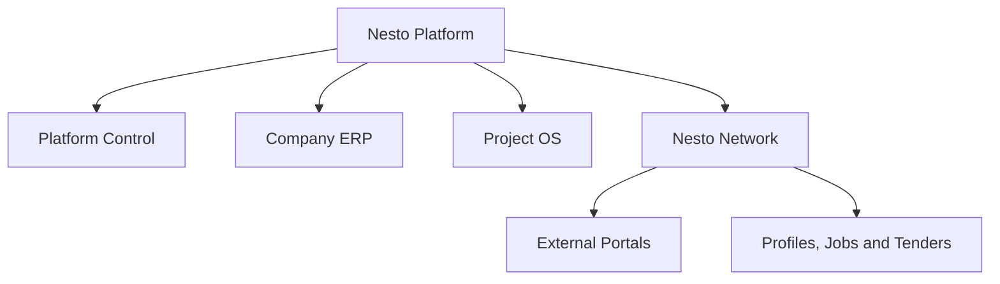
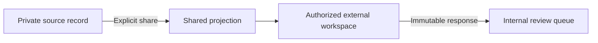
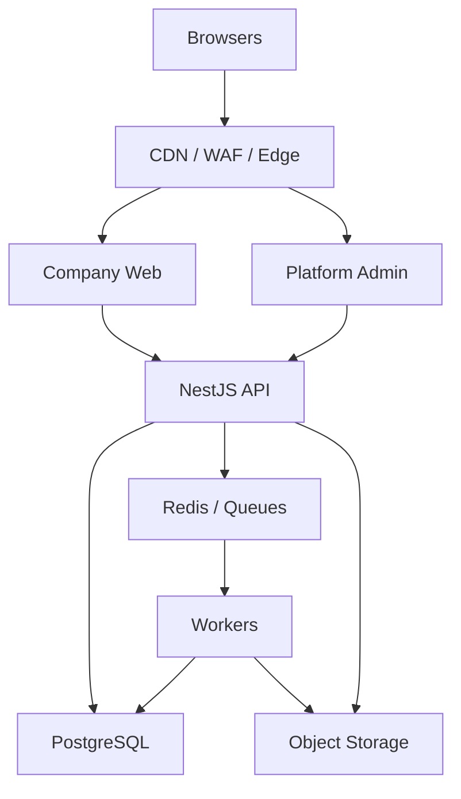

# Nesto Master Architecture PRD

**Document ID:** NESTO-ARCH-PRD-001
**Version:** 1.0 — Implementation Baseline
**Date:** 4 September 2026
**Status:** Approved architecture baseline for estimation and implementation
**Audience:** Product, UX/UI, frontend, backend, data, platform, security, QA, DevOps and technical leadership
**Delivery form:** Responsive web platform, English and Albanian, EU-hosted

---

## 0. Document authority

This document is the consolidated technical and product architecture for Nesto. It defines the system that the development team shall build, the boundaries between domains, the shared platform contracts, the security invariants, the target data model, the principal workflows, and the required delivery order.

It consolidates the existing Nesto/Construction OS master requirements, the latest Platform Foundation and Project Core specifications, the platform architecture constitution, the domain database and event architecture, and the final product decisions made during discovery.

### 0.1 Requirement precedence

When requirements conflict, use this order:

1. The latest explicit Product Owner decision.
2. This Master Architecture PRD.
3. A later approved module PRD that explicitly amends this document.
4. Earlier module PRDs where this document is silent.
5. A recorded Architecture Decision Record for technical detail that does not change product behavior.

Developers shall not resolve a material product ambiguity silently. The issue must be recorded as a product decision or ADR before implementation.

### 0.2 Normative language

- **MUST / SHALL:** mandatory for production acceptance.
- **MUST NOT / SHALL NOT:** prohibited.
- **SHOULD:** expected unless an ADR documents a justified exception.
- **MAY:** optional and safe within the stated boundary.
- **Deferred:** must have an extension point but no user-facing implementation in the current release.

### 0.3 Change control

Every material change must include:

- requirement ID and source;
- reason and owner;
- affected domains, APIs, events, database entities, screens and tests;
- migration and backward-compatibility impact;
- rollout and rollback plan;
- updated acceptance criteria.

The repository must contain:

```text
docs/
├── prd/
│   └── Nesto_Master_Architecture_PRD_v1.0.md
├── adr/
├── requirements/
│   └── requirements-register.csv
├── api/
├── events/
├── runbooks/
└── threat-models/
```

---

## 1. Product definition

### 1.1 Product statement

Nesto is a multi-tenant construction ERP, Project Operating System and controlled professional inter-company network. It combines four systems under one governed platform:

1. **Company ERP** — runs the internal company.
2. **Project OS** — plans, executes and controls construction projects.
3. **Nesto Network** — connects verified companies and professionals without exposing private ERP data.
4. **Platform Control** — governs company lifecycle, verification, templates, security and platform operations.

Nesto is not a generic social network, a simple project board, a file-sharing website or a public marketplace with uncontrolled access. It is a permission-aware operational system in which every business fact has one authoritative owner and every external disclosure is explicit.

### 1.2 Core value proposition

Nesto shall provide one connected operational graph across:

- company organization and users;
- projects, WBS, physical locations, schedules and tasks;
- documents, drawings, revisions, RFIs and submittals;
- site execution, workforce, equipment and materials;
- BOQ, budgets, cost control, procurement, contracts, invoices and payments;
- QA/QC, HSE, design changes and variations;
- CRM, clients, sales and units;
- verified companies, professionals, jobs and tenders;
- controlled client and external-partner collaboration.

The same record must be reachable through canonical, permission-safe links from project, task, document, notification, search, calendar, report, network or portal context without duplicating the authoritative record.

### 1.3 Product outcomes

- One reliable source of truth per business domain.
- Zero cross-tenant or unauthorized cross-company leakage.
- Construction-specific workflows that remain configurable without becoming arbitrary.
- Strong auditability for operational, commercial, financial and formal communication.
- Clear separation between internal records, shared collaboration records and public profile data.
- Architecture that launches as a modular monolith and can later extract services without rewriting domain contracts.
- A responsive, role-aware experience that remains one product rather than separate copied applications.

### 1.4 Non-goals

Nesto shall not initially be:

- a statutory accounting replacement;
- a banking, payment-processing or automatic billing system;
- a public social feed, follower, like, endorsement or ratings platform;
- a Primavera P6 replacement with unrestricted CPM/resource leveling;
- a general-purpose no-code workflow builder;
- a per-client source-code fork;
- a native mobile application in the initial releases;
- a fully offline system until a separate synchronization PRD is approved;
- an automatic decision maker for tender winners, hiring or company ratings.

---

## 2. Confirmed product decisions

| Area | Binding decision |
|---|---|
| Architecture | Full-stack TypeScript monorepo; modular monolith first; strict bounded contexts from day one. |
| Frontend | Separate Company Web and Platform Admin applications; responsive web; English and Albanian. |
| Backend | NestJS REST API with OpenAPI; background worker; no browser-to-database access. |
| Data | PostgreSQL, Prisma, tenant/company/project ownership, RLS defense in depth, Decimal money. |
| Infrastructure | Redis/BullMQ, S3-compatible private object storage, transactional outbox, EU hosting. |
| Company control | Platform Admin alone activates, suspends, reactivates and finally deletes a company. |
| Ownership | Exactly one Primary Owner per live company; Company Admin is not Owner-equivalent. |
| MFA | Mandatory for Platform Admin and Primary Owner; TOTP plus single-use recovery codes in V1. |
| Billing | Manual outside Nesto initially; Nesto stores plan, seat and commercial metadata only. |
| Lifecycle | Suspension normally creates 120-hour read-only grace, then lock; deletion becomes eligible 365 days after lock and is never automatic. |
| Tenancy | One explicit active company and one explicit active project at a time; no inferred or mixed context. |
| Departments | Department organizes reporting; it never grants business-data access. |
| Permissions | Policy-driven, deny by default, server-enforced, scope-aware; explicit deny wins. |
| Templates | Protected Nesto master template plus Platform Admin-controlled company variations; existing projects keep immutable snapshots. |
| Projects | Separate Physical Hierarchy ("where") and WBS ("what work"); one owner company per project. |
| Tasks | Exactly one accountable owner after Ready; contributors/watchers do not gain access by assignment. |
| Scheduling | Assisted mode by default; preview/apply required; no silent date movement. |
| Documents | Permanent document passport and immutable revision lineage; old revisions are never overwritten. |
| Finance | Finance owns accounting truth; money uses fixed precision and explicit currency. |
| Network | Company relationship alone gives no project access; project invitation and external scope are separately required. |
| Personal connections | Professional networking and messaging only; never grants company, project, module or document access. |
| Profiles | Static professional profiles; no posts, followers, likes, endorsements, recommendations or company ratings. |
| Jobs | Job posts, applications, pipeline and private talent pool; no interview management or offer generation; hiring never creates an employee account automatically. |
| Tenders | Open or invite-only; verified eligible companies only; multiple rounds; submitted rounds locked; formal clarifications; manual review; winner approval required; post-award handoff manual. |
| Candidate retention | No automatic expiry; archive/manual deletion and legally required deletion remain supported. |
| External notices | No mandatory automatic non-award notice to unsuccessful bidders. |
| Tender documents | No enforced mandatory-document checklist; Procurement reviews files manually and requests clarification. |
| Offline/mobile | Online-first responsive web. Offline command/sync architecture is deferred and must not use blind last-write-wins. |

---

## 3. Target platform map



### 3.1 Platform Control

- Companies and applications
- Verification, activation, suspension, grace, lock and deletion
- Business groups and company metadata
- Subscription/seat metadata
- Master templates and company variations
- Platform administrators
- Legal-policy versions and Help Center
- Support escalation controls
- Security events, audit, jobs, backups and system health
- Global configuration, feature flags and release visibility
- Public company and professional verification queues

Platform Control MUST NOT contain a routine tenant-data explorer. Operational company data is inaccessible unless a later, explicit, time-boxed and audited support-access workflow is approved and active.

### 3.2 Company ERP

- Company Dashboard
- Projects
- CRM / Sales
- HR
- Finance
- Procurement
- Contracts
- Company Network Directory
- Documents
- Team / Users / Access
- Organization Chart
- Company Feed and Activity
- Network Inbox
- Jobs / Talent
- Help / IT Support
- Company Settings

### 3.3 Project OS

- Overview and health
- Physical Structure
- WBS, Work Packages and Activities
- Schedule, milestones, baselines and tasks
- Documents, drawings and revisions
- RFIs and submittals
- Design changes and variations
- BOQ, budget and cost control
- Procurement and contracts
- Site operations and daily reports
- Workforce, equipment, materials and inventory
- QA/QC and HSE
- Project team, directory and external companies
- Project Network Feed and Activity
- Reports

### 3.4 Nesto Network

- Public company profiles
- Company discovery
- Verified project experience
- Company connection requests and relationships
- Project invitations and external scopes
- Relationship Feed and Project Feed
- Network Inbox
- Direct professional messaging
- Shared documents and external actions
- Formal correspondence
- Professional profiles and connections
- Jobs and Talent
- Tender Marketplace

### 3.5 External Portals

- Client Portal
- External Partner Portal
- Supplier/Contractor participation surfaces
- Published project projections
- Immutable external submissions

External portals shall consume allowlisted projection APIs. They shall never query unrestricted internal domain tables or mutate internal records directly.

---

## 4. Architecture principles and invariants

### 4.1 Modular monolith first

Nesto shall launch as a modular monolith because core workflows span multiple transactionally complex domains and product rules are still evolving. Logical boundaries are mandatory even when deployment is combined.

Each bounded context owns:

- its domain model;
- application services;
- repositories and database schema/migrations;
- commands and query contracts;
- events and projections;
- permission vocabulary;
- tests, metrics and runbooks.

No domain may write another domain's tables. Cross-domain behavior uses source-owned APIs, application services, commands or registered events.

### 4.2 One authoritative owner per fact

| Fact | Authoritative domain |
|---|---|
| Account, credentials, session, MFA | Identity |
| Tenant, legal company, lifecycle | Platform Foundation / Tenancy |
| Role, grant, policy decision | Authorization |
| Employee, salary, leave, certification | HR |
| Project identity and participation | Projects |
| Physical hierarchy and WBS | Project Core |
| Task state and assignment | Tasks |
| Controlled file and revision | Documents |
| Contract legal state and version | Contracts |
| Invoice, payment, allocation, actual cost | Finance |
| RFQ, tender, bid, PO | Procurement |
| Stock and stock movement | Inventory |
| Physical progress | Work Progress |
| Quality acceptance and handover | QA/QC |
| Safety incident and corrective action | HSE |
| Client, lead and sales state | CRM / Sales |
| Public profile and connection | Network |
| Workflow routing and decisions | Workflow Engine |
| Delivery preference and delivery state | Notifications |
| Search result | Derived Search projection |
| KPI/dashboard/report | Derived Analytics projection |

Derived systems may identify inconsistency but MUST NOT silently rewrite the authoritative source.

### 4.3 No transitive access

Access to a task, notification, report row, search result, model object, feed entry, connection, public profile or linked summary does not grant access to the referenced source record. The source permission is re-evaluated on every open, download, export and action.

### 4.4 Safe external sharing

The internal record stays private. An explicit publishing or collaboration command creates a minimized shared projection with an audience, purpose, source version, validity and revocation state.



### 4.5 Shared engines only once

Modules shall not build alternative implementations of authorization, audit, workflow, notifications, comments, attachments, search, numbering, imports, exports or activity timelines.

### 4.6 IDs, versions and time

- Internal IDs: UUIDv7 or another approved time-ordered globally unique UUID.
- Human codes: separate company/project scoped sequences; never primary keys.
- Mutable aggregate roots: integer `recordVersion`.
- Structural trees/graphs: independent `structureRevision` or `graphRevision`.
- Time persistence: UTC instants plus IANA timezone where local behavior matters.
- Enums: stable `UPPER_SNAKE_CASE` codes, never localized labels.
- Published policies, template versions, submitted bids, issued correspondence, posted finance records and controlled document revisions are immutable.

---

## 5. Reference technical architecture

### 5.1 Approved stack

| Layer | Technology | Rule |
|---|---|---|
| Monorepo | pnpm workspaces + Turborepo | One full-stack TypeScript repository |
| Company Web | Next.js, React, TypeScript | Responsive internal/network/portal shell as authorized |
| Platform Admin | Separate Next.js application | Separate routes, audience, session and deployment |
| API | NestJS, REST, OpenAPI | Versioned `/api/v1`; API is authoritative |
| Persistence | PostgreSQL + Prisma | Domain-owned schemas, strict scope, RLS defense in depth |
| Jobs | Redis + BullMQ | Idempotent background work with explicit context |
| Events | Transactional outbox | Atomic business change and event creation |
| Files | S3-compatible EU object storage | Private, encrypted, quarantine and short-lived access |
| Search | OpenSearch/Elasticsearch-compatible or PostgreSQL first | Derived, permission-minimized and rebuildable |
| Realtime | SSE initially | Permission-aware event invalidation and progress updates |
| Observability | OpenTelemetry + metrics/logs/traces | Correlation across HTTP, jobs and events |
| CI/CD | GitHub Actions + containers | Quality and security gates before deploy |
| Local | Docker Compose | PostgreSQL, Redis, object storage and mail catcher |
| Staging | Railway or equivalent EU environment | Synthetic/anonymized data only |
| Production | EU managed cloud | Containerized, encrypted and horizontally scalable |

### 5.2 Deployment topology



### 5.3 Repository layout

```text
apps/
├── company-web/
├── platform-admin/
├── api/
└── worker/
packages/
├── ui/
├── contracts/
├── database/
├── auth/
├── policy/
├── events/
├── i18n/
├── observability/
├── config/
└── testing/
domains/
├── foundation/
├── identity/
├── authorization/
├── organization/
├── projects/
├── project-core/
├── tasks/
├── documents/
├── design-control/
├── contracts/
├── finance/
├── procurement/
├── inventory/
├── site-operations/
├── work-progress/
├── qaqc/
├── hse/
├── hr/
├── crm/
├── network/
├── jobs/
├── tenders/
├── portals/
├── workflow/
├── notifications/
├── search/
└── reporting/
```

### 5.4 Dependency rules

- Domain code does not import another domain's repository or ORM models.
- Shared packages contain technical primitives, not shared mutable business logic.
- No unrestricted generic repository or generic CRUD endpoint.
- Prisma clients are wrapped by domain repositories requiring an explicit execution context.
- A mutation, its audit evidence and its outbox event commit atomically when required.
- Cross-domain reads use published query contracts or read projections.
- Circular domain imports fail architecture tests.
- Frontend code consumes generated API clients and shared stable enums; it does not duplicate DTO definitions.
- Service extraction must preserve the same command/query/event contracts.

### 5.5 Future service extraction criteria

A domain may become a separate service only when one or more measurable conditions exist:

- independent scaling or latency profile;
- data residency or enterprise database isolation;
- materially different availability objective;
- independent release cadence with low transaction coupling;
- security boundary requiring separate credentials or infrastructure;
- operational load that harms other domains.

Microservice extraction is not permitted merely for team preference.

---

## 6. Tenancy, groups and company context

### 6.1 Permanent hierarchy

```text
Tenant / Workspace boundary
└── Business Group (optional)
    └── Legal Company
        ├── Branches
        ├── Company Memberships
        └── Company-owned records
```

Most customers may begin with one Tenant and one Legal Company. The architecture must also support a corporate group containing multiple legal companies without weakening company-level isolation.

### 6.2 Context object

Every authenticated operation receives an immutable server-resolved context:

```ts
type ExecutionContext = {
  requestId: string;
  correlationId: string;
  actorType: 'USER' | 'PLATFORM_ADMIN' | 'EXTERNAL_USER' | 'SYSTEM';
  actorId: string;
  audience: 'COMPANY' | 'PLATFORM' | 'EXTERNAL_PORTAL' | 'PUBLIC';
  tenantId?: string;
  activeCompanyId?: string;
  activeProjectId?: string;
  membershipId?: string;
  externalOrganizationId?: string;
  sessionId?: string;
  locale: 'en' | 'sq';
  now: string;
};
```

Client-supplied tenant/company/project identifiers are selection requests only. The server validates them against the current identity, membership, relationship and lifecycle before creating the context.

### 6.3 Tenant isolation invariants

- Every tenant-owned aggregate contains non-null `tenantId`.
- Every company-owned aggregate also contains non-null `owningCompanyId`.
- Every project-scoped record stores `projectId`, even if inferable.
- All related IDs are resolved inside the current context before write.
- Compound foreign keys and uniqueness constraints include tenant/company where practical.
- PostgreSQL RLS is enabled for tenant tables as defense in depth.
- Database context is set transaction-locally, never in a pooled global session.
- Jobs, events, exports, imports, caches, indexes and file metadata carry the same scope.
- Unauthorized cross-scope IDs produce non-disclosing responses.
- A company switch invalidates company/project caches and clears incompatible URL state.
- A project switch cannot carry record IDs from the previous project.

### 6.4 Corporate group behavior

- Group membership does not automatically grant access to every child company.
- Group-level roles resolve to explicit company scopes.
- Consolidated reporting is a permission-filtered projection, never a shortcut to raw company tables.
- Intercompany transactions preserve both source and counterparty company IDs.
- Shared-service employees receive explicit company grants and active-company selection.
- A record has exactly one owning company unless it is an explicitly modeled shared/JV aggregate.

### 6.5 Joint ventures

JV support is architecture-ready but not part of the first implementation slice. A future `JointVentureScope` shall define project, lead company, participant companies, module/record sharing and authority. JV participation shall not merge tenant ownership or permit direct cross-company table access.

---

## 7. Identity, authentication and sessions

### 7.1 Identity separation

Nesto separates:

- **User Account:** global sign-in identity.
- **Professional Profile:** portable public/private professional identity.
- **Company Membership:** role and access within one legal company.
- **Employee Record:** private HR/employment data.
- **Project Membership:** authorized project participation.
- **External Relationship Membership:** access to an external collaboration workspace.

No role is stored as a permanent property of the global User.

### 7.2 Authentication controls

- Password hashing: Argon2id with parameters reviewed against current OWASP guidance.
- Access credential: short-lived.
- Refresh token: rotating token family in `Secure`, `HttpOnly`, `SameSite` cookie.
- Refresh-token reuse: revoke family and create security event.
- MFA: mandatory for Platform Admin and Primary Owner; optional/configurable for others.
- V1 factor: TOTP with encrypted secret and hashed single-use recovery codes.
- Sign-in, recovery, invitation and MFA endpoints: rate-limited by IP and normalized identity.
- CSRF and origin checks: mandatory for cookie-authenticated mutations.
- Recovery/reset: generic responses, hashed expiring token, session revocation after success.
- Security stamp/session version: invalidated on password, MFA, role, membership, lifecycle or privileged access change.
- Device/session page: list and revoke sessions.
- Secrets and raw tokens: never logged or stored in audit payloads.

### 7.3 Invitations

- Invitations are single-use, expiring and stored as token hashes.
- Accepting an invitation creates or links a global identity only after safe verification.
- Pending invitations count against licensed seats where configured.
- Resend rotates the token and preserves invitation lineage.
- Revoked/accepted/expired invitations are immutable history.
- An invitation to one company grants no access to another.
- Hiring status never creates an invitation automatically.

### 7.4 Account and membership states

```text
Account: INVITED → ACTIVE → DISABLED
Membership: PENDING → ACTIVE → SUSPENDED → ENDED
Project Membership: SCHEDULED → ACTIVE → ENDED
External Access: INVITED → ACTIVE → REVOKED / EXPIRED
```

Disabling a global account blocks all audiences. Suspending one company membership affects only that company. Removing project membership does not remove company membership.

---

## 8. Authorization architecture

### 8.1 Policy model

Authorization is deny-by-default and evaluated on the backend for every route, list, record, field, action, download, search result, report, export, job and event subscription.

Effective access resolves:

```text
Platform audience and privilege
→ active account/session state
→ tenant and active company membership
→ company lifecycle and legal gates
→ base role permissions
→ explicit company grants/denies
→ project membership and project overrides
→ record relationship and workflow state
→ field/section classification
→ explicit deny wins
```

### 8.2 Base company roles

- `OWNER`
- `COMPANY_ADMIN`
- `EXECUTIVE`
- `PROJECT_MANAGER`
- `ARCHITECT`
- `ENGINEER`
- `FINANCE`
- `PROCUREMENT`
- `HR`
- `SALES`
- `HSE`
- `QA_QC`
- `IT`
- `FIELD`

Base roles are protected Nesto roles. Companies may map job titles and dashboard labels but cannot silently change the meaning of protected permissions. Arbitrary custom roles are deferred until a separate governance model is approved.

### 8.3 Project roles

- `MANAGER`
- `PLANNER`
- `COORDINATOR`
- `CONTRIBUTOR`
- `VIEWER`

Project assignment does not create access. The user must already hold a valid company membership and project membership or an explicit company-wide permission.

### 8.4 Permission key standard

Permissions use namespaced keys:

```text
project.read
project.settings.update
project.member.manage
wbs.manage
task.create
task.update.assigned
document.revision.issue
finance.payment.post
procurement.tender.select_preferred
workflow.approval.decide
network.project_invitation.manage
platform.company.activate
```

Each permission declares allowed scopes: platform, tenant, company, project, own, assigned, department-visible, shared external or public.

### 8.5 Record and field security

- Finance, HR, Legal, salary, bids and private notes require field/section rules beyond route permission.
- Read models select only permitted columns; prohibited data is not loaded and hidden later.
- List totals, facets and autocomplete cannot reveal restricted record existence.
- API serializers receive an authorization decision and safe field set.
- Export and reporting policies equal or exceed interactive-view policy.
- External users see only explicitly published projection fields.
- Search may show a locked result only where product policy explicitly allows discovery; locked metadata itself must be allowlisted.

### 8.6 Protected authority rules

- Exactly one Primary Owner exists per live company.
- Company Admin cannot create, promote, modify, disable or replace the Owner.
- Owner cannot remove or disable themselves without completing formal transfer.
- Owner transfer requires recent authentication, recipient MFA and atomic replacement.
- Platform Admin cannot browse operational tenant data by technical seniority.
- Tender preferred-bidder selection is not final until central approval succeeds.
- Workflow approval rights are validated server-side against the actual work item; UI visibility is never sufficient.

### 8.7 Authorization implementation contract

Every application service follows:

1. Resolve authenticated execution context.
2. Apply audience, company lifecycle and legal gates.
3. Evaluate action permission without loading unauthorized record details.
4. Load target using tenant/company/project-scoped repository.
5. Validate every related ID in the same context.
6. Apply record/field/workflow rules.
7. Execute transaction with audit/outbox.
8. Return safe representation.

---

## 9. Company lifecycle, activation and onboarding

### 9.1 Company states

| State | Access | Mutations | Entry |
|---|---|---|---|
| `DRAFT` | Platform metadata only | Platform metadata | Company candidate created |
| `UNDER_REVIEW` | Platform Admin only | Review metadata | Application submitted or review started |
| `ACTIVE_ONBOARDING` | Owner; invitees may see waiting state | Onboarding-scoped | Platform Admin activation |
| `ACTIVE` | Authorized users | Permission-controlled | Onboarding completed |
| `READ_ONLY_GRACE` | Authorized users for 120 hours | No business mutation; export permitted | Normal suspension |
| `LOCKED` | No company session | None | Grace expiry or immediate security lock |
| `DELETION_ELIGIBLE` | No company session | Retention actions only | 365 days after `lockedAt` |
| `DELETING` | None | Deletion worker only | Manual final confirmation |
| `DELETED` | None | None | Primary deletion completed |

### 9.2 Lifecycle rules

- Only Platform Admin can activate, suspend, reactivate or confirm deletion.
- A public company application is an intake record, not a live tenant and never self-activates.
- Standard suspension creates exactly 120 hours of read-only access.
- A documented security incident may cause immediate lock.
- Read-only is enforced at the API, worker and external portal layers, not only the UI.
- At lock, relevant sessions are revoked and scheduled mutation jobs are canceled or blocked.
- Reactivation restores `ACTIVE` or `ACTIVE_ONBOARDING` according to onboarding completion.
- Deletion eligibility is calculated from `lockedAt`.
- Warnings are issued at suspension, 30 days before eligibility and 7 days before eligibility.
- Reaching eligibility never auto-deletes data.
- Final deletion requires recent authentication, typed confirmation, reason, recoverable preflight and an idempotent deletion runbook.
- A minimal legal/audit tombstone may remain; operational data and object files do not.
- Backups expire through their normal retention cycle and are not rewritten selectively.

### 9.3 Activation flow

1. Platform Admin creates or approves company candidate metadata.
2. Platform Admin verifies required legal/company identity as applicable.
3. Platform Admin sets plan label, seat limit, regional defaults and template assignment.
4. Activation preflight checks duplicate company, Primary Owner email, template, seat and legal versions.
5. One idempotent transaction creates the live company state, pending Owner membership, invitation, audit and outbox event.
6. Worker sends invitation.
7. Owner accepts invitation, establishes password/MFA and accepts current legal versions.
8. Owner enters resumable onboarding.

### 9.4 Guided onboarding

Required steps:

1. Welcome and legal acceptance.
2. Company profile and legal/display identity.
3. Regional settings: language, timezone, currency, date and workweek defaults.
4. Departments and reporting foundation.
5. Owner's primary department.
6. Initial user invitations within seat limit.
7. First project identity and template provisioning.
8. Review and completion.

Onboarding is server-persisted, autosaved, versioned and resumable. Completion requires current legal acceptance, valid company profile/settings, exactly one Owner, Owner department, no seat violation and successful first-project provisioning.

### 9.5 Template governance

- Nesto owns one protected master template family.
- Platform Admin publishes immutable template versions.
- Platform Admin may create a controlled company variation based on a published version.
- Project creation resolves and stores an immutable `ProjectTemplateSnapshot` containing source IDs, version, hash and payload.
- Existing projects never receive silent template changes.
- Upgrades require explicit preview, migration handler, audit and rollback strategy.
- Company-created arbitrary templates and custom scripts are not permitted in the current baseline.

### 9.6 Project provisioning

1. API creates Project in `PROVISIONING`, its creator membership, template snapshot, provisioning rows, audit and outbox event.
2. Worker executes registered idempotent handlers.
3. Each handler records `PENDING`, `RUNNING`, `SUCCEEDED` or `FAILED`, attempts and safe error reference.
4. Retry resumes only incomplete handlers and cannot duplicate seeded data.
5. Project becomes `DRAFT` only when all mandatory handlers succeed.
6. UI receives polling/SSE progress and a deterministic recovery action.

---

## 10. Shared platform engines

### 10.1 Engine registry

| Engine | Mandatory responsibility |
|---|---|
| Identity & Context | Accounts, sessions, MFA, invitations, active company/project and service identity |
| Policy | Deny-by-default permission and field decisions |
| Workflow & Approval | Versioned definitions, instances, work items, decisions, delegation, escalation and finalization handshake |
| Task & Action | Assignments, due dates, dependencies, status, contributors, watchers and linked source records |
| Comments & Mentions | Internal/shared threads, visibility, mentions, attachments and notification triggers |
| Documents | File identity, quarantine, revision lineage, controlled status, access and retention |
| Audit & Activity | Append-only security evidence and permission-filtered user timelines |
| Notifications | In-app/email delivery, preference, critical override, digest, dedupe and receipt state |
| Search | Permission-minimized index, autocomplete, facets, access recheck and rebuild |
| Reporting | Governed metrics, permission-before-aggregation, snapshots, scheduled exports and lineage |
| Numbering | Company/project/year scoped human codes with concurrency-safe reservation |
| Import/Export | Upload, map, validate, preview, apply, export, expiry and formula-injection protection |
| Configuration | Feature flags, company variation, module registry, controlled custom fields and release targeting |
| Attachments | Presigned upload, malware state, checksum and links to domain records |
| Collaboration | Company relationships, shared projections, external actions and formal correspondence |

### 10.2 Workflow engine boundary

Workflow owns routing, work items, approvals, delegation, SLA and decision history. The source module owns the business record and final consequence.

An approved workflow does not directly equal a completed business transition:

```text
Source requests workflow
→ Workflow resolves versioned definition
→ Participants decide
→ Workflow reaches approved/rejected outcome
→ Source revalidates current record/version/permission
→ Source applies or rejects final business transition
→ Source confirms finalization
```

Material source changes may invalidate or restart a workflow according to the definition. Approvers cannot edit the submitted source snapshot through the decision screen.

### 10.3 Audit versus activity

- `AuditEvent` is security/compliance evidence and append-only.
- `ActivityEvent` is a permission-filtered user-facing projection.
- Both originate from the same committed business action and correlation ID.
- Activity may omit confidential before/after data; audit retains redacted structured changes.
- Deleting a business record must not cascade-delete its audit evidence.

### 10.4 Configuration precedence

```text
Protected Nesto default
→ Published platform version
→ Platform Admin company variation
→ Project configuration where explicitly allowed
→ User preference for presentation/delivery only
```

A lower layer cannot weaken security, retention, protected states, audit, required approvals or data ownership.

---

## 11. Data architecture

### 11.1 Logical database topology

The initial production deployment may use one managed PostgreSQL cluster, but business domains must have separate schema ownership and migration streams.

```text
postgres
├── foundation
├── identity
├── authorization
├── organization
├── projects
├── project_core
├── tasks
├── documents
├── contracts
├── finance
├── procurement
├── inventory
├── site
├── quality
├── hse
├── hr
├── crm
├── network
├── workflow
├── notifications
├── integration
└── audit
```

Each domain database role receives write permission only to its own schema. Cross-schema writes are prohibited. In a modular-monolith deployment, cross-domain application services may share a process, but not persistence ownership.

### 11.2 Canonical aggregate contract

Every mutable aggregate root shall include, as applicable:

```ts
type AggregateRoot = {
  id: string;                 // immutable UUIDv7
  tenantId: string;
  owningCompanyId?: string;
  projectId?: string;
  code?: string;              // human-readable, scoped
  lifecycleStatus: string;
  recordVersion: number;
  confidentiality?: 'PUBLIC' | 'INTERNAL' | 'RESTRICTED' | 'CONFIDENTIAL';
  createdAt: string;
  createdBy: string;
  updatedAt: string;
  updatedBy: string;
  archivedAt?: string;
  archivedBy?: string;
  sourceSystem?: string;
  importBatchId?: string;
};
```

Technical archive state is separate from business lifecycle status. Published/submitted/posted/issued records add immutable revision or posting structures rather than allowing destructive edits.

### 11.3 Entity catalogue

#### Foundation, identity and organization

| Entity | Key purpose / constraints |
|---|---|
| `Tenant` | Top isolation/subscription boundary; region and deployment class |
| `BusinessGroup` | Optional corporate hierarchy and reporting currency |
| `Company` | Legal company, lifecycle, verification and ownership metadata |
| `CompanyRelationship` | Parent/child/shared-service/JV relation with effective dates |
| `Branch` | Company office/operating location |
| `CompanyCommercial` | Plan label, seat limit, renewal and manual billing notes |
| `CompanySettings` | Language, timezone, currency, week/date settings |
| `User` | Global identity only; normalized email unique |
| `Credential` | Password hash and security metadata |
| `Session` | Audience, token family, expiry, device and revocation |
| `MfaMethod` | Encrypted factor secret and verification state |
| `RecoveryCode` | Hashed, single-use code |
| `SecurityStamp` | Invalidates sessions on authority changes |
| `CompanyMembership` | Company + User unique; role, department, manager, status |
| `Department` | Company organization; never grants access |
| `PermissionGrant` | Allow/deny, permission key and optional project/record scope |
| `Invitation` | Hashed token, target, status, expiry and resend lineage |
| `Employee` | HR-owned employment record linked to membership where applicable |
| `ProfessionalProfile` | Network-owned portable profile, separate from HR/private account |
| `OnboardingProgress` | Versioned step data, revision and completion state |
| `LegalDocumentVersion` | Immutable policy version and material-change flag |
| `LegalAcceptance` | User/company evidence for exact policy version |

#### Projects, plan and work

| Entity | Key purpose / constraints |
|---|---|
| `TemplateFamily` | Protected Nesto template identity |
| `TemplateVersion` | Immutable published template payload/hash |
| `CompanyTemplateVariation` | Platform Admin-owned company variation |
| `Project` | Company-owned identity, state, dates, timezone and manager |
| `ProjectTemplateSnapshot` | Immutable resolved project template |
| `ProvisioningStep` | Idempotent project setup handler state |
| `ProjectMembership` | Company membership + project role + effective dates |
| `ProjectPlanState` | Structure/graph/task revisions and selected baseline |
| `PhysicalNode` | Separate typed physical hierarchy node |
| `WbsNode` | Separate typed scope/work node |
| `PhysicalWbsLink` | Explicit many-to-many classification link |
| `WorkItem` | Task or milestone; one accountable owner after Ready |
| `WorkItemContributor` | Contributor relationship without access inheritance |
| `WorkItemWatcher` | Notification relationship without edit authority |
| `ChecklistItem` | Ordered task acceptance items |
| `WorkDependency` | FS/SS/FF/SF dependency with lag and graph revision |
| `ProjectCalendar` | Timezone, weekdays, intervals, holidays, exceptions |
| `SchedulePreview` | Expiring proposed changes and source-revision hash |
| `Baseline` | Immutable plan snapshot and source revisions |
| `SavedView` | Owner/shared filter, sort, grouping and column configuration |
| `ImportJob` | File, mapping, validation hash and apply status |
| `ExportJob` | Scope, requester, result object and expiry |

#### Documents and design control

| Entity | Key purpose / constraints |
|---|---|
| `FileObject` | Object key, checksum, MIME, size, encryption and malware state |
| `Document` | Permanent passport/code/category/owner/status |
| `DocumentRevision` | Immutable revision lineage and exact file reference |
| `DocumentStatusHistory` | Controlled status transitions |
| `DocumentDistribution` | Recipient, purpose, delivery and acknowledgement |
| `DocumentShortcut` | Non-owning reference from another location/entity |
| `DocumentLink` | Typed exact source-to-document/revision relation |
| `Transmittal` | Issued collection of exact revisions and recipients |
| `Rfi` | Technical question, responsibility, due date and response |
| `Submittal` | Submitted technical/material package and review result |
| `DesignChange` | Design-originated change and impact assessment |
| `Variation` | Controlled commercial/scope/time change, separately approved |

#### Commercial, finance and supply chain

| Entity | Key purpose / constraints |
|---|---|
| `Boq` / `BoqItem` | Measured scope and quantities; versioned baseline |
| `CostCode` | Controlled cost classification/CBS |
| `Budget` / `BudgetLine` | Approved cost plan by project/cost code |
| `Commitment` | Approved committed spend source |
| `Contract` | Legal agreement identity and current effective version |
| `ContractVersion` | Immutable legal/commercial version |
| `ContractParty` | Internal/external party and role |
| `ContractFinancialSummary` | Finance-approved manual values and reconciliation state |
| `PurchaseRequisition` | Internal procurement demand |
| `Rfq` | Supplier quotation request |
| `Quotation` | Immutable supplier submission/revision |
| `PurchaseOrder` / `PurchaseOrderLine` | Approved commitment and ordered quantity |
| `Delivery` | Supplier delivery event |
| `GoodsReceipt` | Accepted/rejected received quantity |
| `Warehouse` / `StockItem` | Inventory location and item master |
| `StockMovement` | Immutable receipt/issue/transfer/adjustment |
| `Invoice` / `InvoiceLine` | Payable/receivable claim and coding |
| `Payment` | Immutable payment/receipt record |
| `PaymentAllocation` | Allocation across invoice/installment/contract/unit |
| `Retention` | Held amount, release conditions and state |
| `AdvancePayment` | Advance and recovery schedule |
| `Forecast` | Versioned cost/finish estimate projection |

#### Site, workforce, assets, quality and safety

| Entity | Key purpose / constraints |
|---|---|
| `DailySiteReport` | Project/date/weather/notes and evidence |
| `DailyWorkforceEntry` | Individual or subcontractor manpower total |
| `EquipmentUsage` | Owned/rented equipment and operating hours |
| `MaterialConsumption` | Quantity consumed linked to location/WBS/BOQ |
| `ProgressMeasurement` | Measured physical work and evidence |
| `InspectionRequest` | Request for quality inspection |
| `Inspection` | Criteria, result, evidence and inspector |
| `CorrectiveAction` | Remediation task, due date and closure evidence |
| `HandoverPackage` | Quality-complete deliverable set |
| `HseIncident` | Incident/near miss/unsafe/environmental classification |
| `HseInspection` | Safety inspection/checklist result |
| `ToolboxTalk` | Attendance and topic evidence |
| `Asset` | Equipment/vehicle identity and ownership |
| `MaintenanceRecord` | Planned/corrective maintenance and cost link |

#### CRM, network, jobs and tenders

| Entity | Key purpose / constraints |
|---|---|
| `Lead` | CRM prospect and source |
| `Opportunity` | Pipeline stage and expected value |
| `Proposal` | Versioned commercial proposal |
| `Client` | Party-linked client record |
| `Unit` | Commercial/physical unit where applicable |
| `CompanyPublicProfile` | Company-controlled public fields |
| `CompanyVerification` | Formal platform review and evidence |
| `VerifiedProjectExperience` | Public selected experience verified from Nesto participation |
| `CompanyConnection` | Requested/accepted company relationship; no data access |
| `ProjectInvitation` | Separate invitation to collaborate on one project |
| `ExternalAccessScope` | Allowlisted modules/actions/records for external company |
| `ExternalAction` | Shared action linked to private internal execution |
| `FormalCorrespondence` | Immutable sent official communication |
| `ProfessionalConnection` | Person-to-person networking only |
| `DirectMessageThread` | Professional or business-context messaging |
| `JobPost` | Company vacancy and publication state |
| `JobApplication` | Candidate application and pipeline state |
| `TalentPoolEntry` | Company-private saved candidate, tags and notes |
| `Tender` | Open/invite-only opportunity and scope |
| `TenderRound` | Optional deadline, open/closed state and round sequence |
| `TenderBid` | Locked submitted bid snapshot per round |
| `BidClarificationThread` | Formal questions/replies separate from bid mutation |
| `TenderDecision` | Preferred bidder, approval and frozen decision snapshot |

#### Cross-cutting and integration

| Entity | Key purpose / constraints |
|---|---|
| `WorkflowDefinition` / `WorkflowVersion` | Protected versioned orchestration definition |
| `WorkflowInstance` | Runtime linked to source record/version |
| `WorkflowWorkItem` | Participant decision/action |
| `ApprovalDecision` | Immutable decision and evidence |
| `CommentThread` / `Comment` | Visibility-aware collaboration |
| `EntityLink` | Registry-controlled typed relationship |
| `AuditEvent` | Append-only evidence |
| `ActivityEvent` | Derived user-facing timeline |
| `OutboxEvent` | Atomic event publication record |
| `InboxMessage` | Consumer dedupe/idempotency record |
| `ConsumerCheckpoint` | Ordered processing progress |
| `DeadLetter` | Failed event/command evidence and replay state |
| `Notification` / `DeliveryAttempt` | Business notification and channel delivery |
| `SearchDocumentState` | Source/index version and revocation state |
| `ReportDefinition` / `ReportRun` | Governed metric/report and output |
| `FeatureAssignment` | Tenant/company/module release control |

### 11.4 Cross-domain reference contract

- Cross-domain links contain source domain, target type, target immutable ID and exact target revision where business meaning depends on it.
- Target existence and tenant/company compatibility are validated through the target domain's contract.
- No cross-domain cascade delete.
- Archive/supersession retains historical references.
- A reference never transfers permission.
- Orphan/stale references are found by reconciliation jobs.
- Polymorphic types come from a versioned registry, never arbitrary strings.

### 11.5 Money and currency

- Database type: `NUMERIC/DECIMAL`, with precision/scale selected per field family; never Float.
- API representation: decimal string, never JSON binary floating point as source of truth.
- Currency: ISO 4217 code on every monetary amount or inherited only inside an immutable same-currency aggregate.
- Exchange rate: source, rate, effective date, base/quote currency and rounding rule preserved.
- Consolidated totals remain grouped by currency unless an approved conversion basis is applied and shown.
- Posted finance entries are reversed, not edited or deleted.
- Finance-approved manual summaries retain prior version, approver, source and reconciliation status.

### 11.6 Quantities and units

- Quantities use Decimal plus a controlled UOM code.
- Conversion uses a versioned factor and dimension; incompatible dimensions are rejected.
- BOQ, ordered, received, stocked, consumed, installed, rejected and wasted quantities remain separate facts.
- Display rounding never changes stored precision.

### 11.7 Dates and effective time

- Persist instants in UTC.
- Store IANA timezone for company/project/calendar/timed event.
- Store `LocalDate` for business dates that are not instants.
- Preserve both transaction time and effective time for controlled changes.
- Project calendar arithmetic uses project-local wall time and deterministic DST rules.
- Deadlines display in the source record's timezone and the user's timezone where ambiguity exists.

### 11.8 Indexing baseline

- `(tenant_id, id)`
- `(tenant_id, owning_company_id)`
- `(tenant_id, project_id)`
- `(tenant_id, lifecycle_status)`
- `(tenant_id, created_at DESC)`
- status/due-date indexes led by tenant/company/project for work queues
- unique active codes scoped by company/project
- unique membership pairs
- unique idempotency key per operation boundary
- audit scope + occurrence time
- outbox status + next attempt time
- partial indexes for active/unarchived high-volume records

Indexes must follow measured query patterns. Production migration review must include expected cardinality and query plan.

### 11.9 Partitioning candidates

Audit, activity, notification delivery, outbox/inbox, high-volume site events, telemetry and analytical facts may be time/tenant partitioned when thresholds justify it. Partitioning must not weaken RLS, uniqueness or deletion controls.

### 11.10 Archive, deletion and legal hold

- Operational deletion defaults to archive/soft-delete.
- Controlled issued/submitted/posted records are not deletable through ordinary UI.
- Recycle eligibility, retention and restore are domain-specific and audit-logged.
- Legal hold blocks purge of both metadata and object files.
- Tenant deletion uses a dependency-ordered runbook and preserves only approved tombstone evidence.

---

## 12. Project OS architecture

### 12.1 Core model

Nesto separates three concepts:

```text
WHERE?        Project → Physical Hierarchy
WHAT WORK?    Project → WBS → Work Package → Activity
WHO/WHEN?     Project → Work Item → Owner, Contributors, Dates, Status
```

Physical nodes and WBS nodes are different entities and trees. Links between them are explicit. A building/floor/zone is not a work package, and a work package is not a physical location.

### 12.2 Project lifecycle

| State | Behavior |
|---|---|
| `PROVISIONING` | Setup handlers executing; no plan mutations |
| `DRAFT` | Team, hierarchy, WBS and draft work may be prepared |
| `ACTIVE` | Live execution and authorized workflows |
| `ON_HOLD` | Read/export; execution mutations blocked; resume requires reason |
| `CLOSED` | Read/export; reopen requires permission and reason |
| `ARCHIVED` | Historical, hidden by default; restore returns to Closed |

Company lifecycle always overrides project lifecycle.

### 12.3 Project activation gates

- valid name, company-unique code, type and timezone;
- active Project Manager membership;
- valid default Project Calendar;
- successful immutable template snapshot/provisioning;
- at least one task-accepting WBS work package;
- no failed import or invalid dependency graph;
- physical Site node where required by project type.

### 12.4 Physical hierarchy

Base node types:

```text
PROJECT_ROOT
└── SITE
    ├── BUILDING / BLOCK
    │   ├── FLOOR / LEVEL
    │   │   └── ZONE / ROOM / UNIT / AREA
    │   └── FACADE / ROOF / EXTERNAL_AREA
    └── INFRASTRUCTURE / SEGMENT
```

Rules:

- one implicit root per project;
- node type declares allowed parent types and maximum depth;
- same-project parent and code validation;
- no cycle or move beneath descendant;
- archive/move preview shows affected descendants and linked records;
- large changes use idempotent jobs with structure revision;
- responsible member is reporting metadata and does not grant access;
- future BIM/GIS links attach by stable node identity.

### 12.5 WBS

Base node types:

```text
WBS_ROOT
└── CONTROL_ACCOUNT / PHASE
    └── WORK_PACKAGE
        └── ACTIVITY_GROUP / ACTIVITY
```

Rules:

- globally unique immutable node ID; project-scoped human code;
- typed parent rules and acyclic tree;
- work items attach only to configured task-accepting node types;
- weights are Decimal and rollups expose unknown/incomplete classification;
- renumbering and moves use preview/apply with `structureRevision`;
- baseline preserves exact WBS version;
- BOQ/cost codes reference WBS but do not become its ownership source.

### 12.6 Work items and tasks

Base task states:

```text
DRAFT → READY → IN_PROGRESS → IN_REVIEW → COMPLETED
                  ↕ BLOCKED ↕
Any valid open state → CANCELLED
```

Required rules:

- exactly one accountable Owner from `READY` onward;
- contributors may work but do not replace accountability;
- watchers receive allowed notifications only;
- assignment targets active Project Members;
- assignment does not grant access;
- blocked state requires reason; unblocking records resolution;
- completion validates required checklist/review and sets 100%;
- reopening preserves completion history and requires reason;
- task can link to one or more physical/WBS/source records through typed links;
- internal comments never become external automatically;
- bulk actions must preview and apply atomically unless an explicitly designed partial mode exists.

### 12.7 Milestones, dependencies and calendars

- Dependency types: Finish-to-Start, Start-to-Start, Finish-to-Finish, Start-to-Finish.
- Lag uses working or elapsed duration according to explicit setting.
- Dependency graph must remain acyclic.
- Project scheduling mode defaults to `ASSISTED`.
- `MANUAL` reports violations but never moves dates.
- `ASSISTED` computes a preview; user selects and applies permitted changes.
- Preview stores source graph/tree/item/calendar revisions, hash, actor and expiry.
- Apply revalidates permissions and revisions and is atomic.
- A stale preview returns `SCHEDULE_PREVIEW_STALE`.
- No automatic resource leveling, cross-project CPM or cost loading in the initial Project Core.

### 12.8 Progress and baselines

- Overall progress is `UNKNOWN` until a valid weighted WBS rollup exists; never show false 0%.
- Physical completion, quality acceptance and financial progress are separate measures.
- Progress rollups preserve source revision and calculation time.
- Baselines are immutable snapshots; correcting the plan creates a new baseline.
- One primary baseline is selected at a time with audit.
- Current/forecast data never mutates the baseline.
- Pending variations and at-risk work are shown separately and do not silently change the approved denominator.

### 12.9 Project health

Computed health: `ON_TRACK`, `AT_RISK`, `DELAYED`, `UNKNOWN` from milestone variance, forecast finish, overdue weighted work, blocked duration and data quality. A Project Manager may apply a reasoned, expiring override. Both computed and overridden states remain visible.

### 12.10 Project navigation

```text
Overview
Plan
├── Physical Hierarchy
├── WBS
├── Milestones
└── Baselines
Work
├── Tasks
├── Board
├── Timeline
└── My Work
Control
├── Progress
├── Documents
├── Cost / BOQ
├── Quality
├── HSE
└── Reports
Project
├── Team
├── Directory
├── External Companies
├── Activity
├── Data Imports/Exports
└── Settings
```

Future modules register through a typed module registry. Unreleased or unauthorized items are absent.

### 12.11 Project API groups

```text
/api/v1/companies/current/projects
/api/v1/projects/{projectId}
/api/v1/projects/{projectId}/members
/api/v1/projects/{projectId}/physical-nodes
/api/v1/projects/{projectId}/wbs-nodes
/api/v1/projects/{projectId}/work-items
/api/v1/projects/{projectId}/dependencies
/api/v1/projects/{projectId}/calendars
/api/v1/projects/{projectId}/schedule/preview
/api/v1/projects/{projectId}/schedule/apply
/api/v1/projects/{projectId}/baselines
/api/v1/projects/{projectId}/imports
/api/v1/projects/{projectId}/exports
/api/v1/projects/{projectId}/activity
```

### 12.12 Project concurrency units

| Mutation | Guard |
|---|---|
| Entity edit | `recordVersion` / `If-Match` |
| Tree move/reorder/renumber | `structureRevision` + affected record versions |
| Dependency/schedule apply | `graphRevision` + work item versions |
| Bulk action | Preview token + selection/source versions |
| Calendar apply | Calendar version + graph revision |
| Baseline | Captured tree/graph/task revisions |
| Import apply | Validation hash + current target revisions |

---

## 13. Operational domain architecture

This section defines each domain's ownership, primary capabilities, main workflow and integration boundary. Detailed screen-level module PRDs may add fields and acceptance criteria but may not violate these boundaries.

### 13.1 Documents and drawing control

**Purpose:** provide a controlled-record system, not a generic attachment folder.

Capabilities:

- permanent Document Passport;
- document/drawing registers;
- immutable revision lineage (`Rev 00 → Rev 01 → Rev 02`);
- draft, review, approved, issued, superseded and archived states;
- controlled transmittals/distribution;
- exact revision links to projects, WBS, locations, tasks, contracts, RFIs and inspections;
- archive/restore and legal hold;
- comments and workflow requests;
- collaboration attachment promotion to a controlled Document;
- permission-aware preview/download and complete access audit.

Rules:

- old revisions are never overwritten;
- exact revision is mandatory for a decision, approval, issued package or contractually meaningful reference;
- file bytes are stored once; other modules store a Document/Revision reference or shortcut;
- uploaded bytes remain quarantined until checksum, type and malware checks pass;
- a user who can see a linked task does not automatically receive document access;
- third-party storage integrations are deferred; Nesto object storage is authoritative in the baseline.

Primary lifecycle:

```text
DRAFT → IN_REVIEW → APPROVED → ISSUED → SUPERSEDED / ARCHIVED
```

Rejected review returns a new editable draft/revision state; it does not alter an issued revision.

### 13.2 RFIs

RFI owns a technical question and formal response, not general chat.

```text
DRAFT → OPEN → ANSWERED → CLOSED
             ↘ OVERDUE
```

Required context: project, originator, responsible party, subject, question, issue date, optional due date, linked exact drawings/documents, WBS/location and attachments. A response is immutable once formally submitted; clarification creates a new response entry or reopens through controlled action. An RFI may trigger a Design Change but does not create one automatically.

### 13.3 Submittals

Submittals manage technical/material submissions and review results.

```text
DRAFT → SUBMITTED → UNDER_REVIEW → APPROVED / APPROVED_AS_NOTED / REVISE_AND_RESUBMIT / REJECTED
```

Each submission round preserves exact documents, sender, timestamp and review decision. Resubmission creates a new round. Approval of a submittal does not automatically create a PO, approve payment or confirm installation.

### 13.4 Design changes and variations

Design Change and Variation are separate:

```text
RFI / issue / client request
→ Design Change assessment
→ revised controlled drawing
→ Variation request where scope/cost/time changes
→ Approval workflow
→ Contract/Budget/Schedule update by owning domains
```

- Design owns technical intent and drawing consequence.
- Contracts owns legal/commercial change.
- Finance owns budget/actual/forecast values.
- Project Core owns schedule updates.
- No approval outcome may directly edit all domains inside one uncontrolled transaction; each source domain finalizes against the approved decision and records reconciliation.

### 13.5 Site operations and daily reports

Daily Site Report includes:

- project-local report date and weather;
- work performed by WBS and physical location;
- manpower by internal person and subcontractor totals;
- equipment on site and operating hours;
- deliveries/materials;
- photos and attachments;
- delays, incidents, inspections and notes;
- author, submitter and approval state where configured.

Reports are draft until submitted. A submitted report is immutable; correction creates an amendment. Site data may feed progress proposals but does not automatically certify physical progress, quality acceptance or payment.

### 13.6 Work progress

Work Progress owns measured execution quantities and progress evidence.

- planned, completed, inspected, accepted and paid quantities remain separate;
- every measurement links to WBS, location, unit of measure, date, evidence and responsible actor;
- approved baseline denominator cannot change silently;
- pending variation work is marked performed-at-risk;
- rework is separate and does not automatically increase net progress;
- progress certification is an explicit workflow, not a side effect of a daily report;
- derived production rates and forecasts preserve source windows and metric version.

### 13.7 QA/QC and handover

Base flow:

```text
Inspection Request
→ Inspection
→ PASS / FAIL
→ Corrective Action if failed
→ Reinspection
→ Closure
→ Handover readiness
```

QA/QC owns acceptance evidence. Physical completion does not imply quality acceptance. In V1, NCR-type behavior is modeled as structured failure/corrective action inside QA/QC rather than a separate NCR module.

Inspection requirements:

- project, WBS/location and inspected scope;
- checklist/specification/exact drawing revision;
- inspector and participants;
- date/time and result;
- observations, photos and attachments;
- corrective action links;
- immutable submitted inspection revision.

Handover packages aggregate permission-safe references to completed inspections, approved documents, open defects, commissioning evidence and sign-offs. They do not duplicate those records.

### 13.8 HSE

HSE supports:

- incidents;
- near misses;
- unsafe conditions;
- environmental events;
- inspections/checklists;
- toolbox talks;
- corrective actions linked to Tasks;
- evidence, severity and closure.

Sensitive personal/medical details use restricted fields. A safety corrective action may create a task, but internal task assignment and HSE confidentiality remain separately authorized. Closure requires evidence and authorized review; deleting an incident after submission is prohibited.

### 13.9 Assets, equipment and fleet

Asset domain owns identity, ownership, assignment, condition, service intervals and maintenance. Site Operations records use; Finance owns depreciation/accounting; HSE owns safety restrictions.

Base lifecycle:

```text
PLANNED / AVAILABLE → ASSIGNED / IN_USE → MAINTENANCE → AVAILABLE → RETIRED
```

An HSE restriction can block assignment but cannot rewrite the Asset record without a source-owned command. Maintenance evidence links exact documents and costs.

### 13.10 Materials and inventory

Material flow:

```text
Purchase Order
→ Delivery
→ Goods Receipt
→ Warehouse/Site Stock
→ Issue/Consumption
→ WBS + Physical Location + BOQ
```

Rules:

- Procurement owns order; Inventory owns receipt/stock movement; Finance owns invoice/payment.
- Stock is calculated from immutable movements, not edited balance fields.
- Negative stock is blocked unless a controlled policy explicitly allows it with warning/audit.
- Adjustments require reason and approval threshold.
- Lot/batch/serial/expiry tracking is configurable by item.
- BOQ, purchased, received, consumed, installed, remaining and waste are separately reportable.

---

## 14. Commercial and enterprise domain architecture

### 14.1 BOQ and cost control

Commercial hierarchy:

```text
BOQ Item
→ Cost Code / CBS
→ Budget Line
→ Commitment
→ Invoice
→ Payment
→ Actual Cost
→ Forecast / Remaining
```

BOQ owns measured scope; WBS owns work decomposition; Finance owns monetary budget/actual. Links are explicit and versioned.

Budget equation views must disclose data currency and basis:

```text
Approved Budget
− Commitments
− Actuals not represented by commitment
= Uncommitted Balance

Estimate at Completion
= Actuals + Remaining Forecast
```

The exact formula set must be metric-versioned. No dashboard may treat a derived total as editable truth.

### 14.2 Finance

Finance capabilities:

- chart/cost-code mapping sufficient for operational control;
- budgets and approved revisions;
- commitments;
- supplier/client invoices;
- payments and receipts;
- payment allocation;
- retention and advance payments;
- cash-flow, forecast and exposure projections;
- operational contract financial summaries;
- reconciliation and warnings;
- permission-filtered dashboards and exports.

Posting rules:

- Draft records are editable.
- Posted records are immutable.
- Correction uses reversal plus replacement.
- Every posting has source record, posting date, currency, amounts, actor and approval evidence.
- Payment allocation cannot exceed remaining allocatable value except through an explicit approved exception.
- Financial values shown on contractor/client profiles come from latest Finance-approved summaries and remain grouped by currency.
- Nesto does not replace statutory accounting in the initial target; accounting export/integration is a controlled future contract.

### 14.3 Contracts

Contracts owns agreement identity, parties, scope, dates, clauses, document versions, obligations, notices, variation links and lifecycle.

```text
DRAFT → INTERNAL_REVIEW → APPROVAL → ACTIVE → SUSPENDED / COMPLETED / TERMINATED → ARCHIVED
```

Rules:

- Active contract references an exact approved Contract Version and controlled document revision.
- Legal and commercial terms cannot be inferred from a mutable attachment.
- Purchase Orders, invoices and variations preserve the effective contract version/reference.
- Contract activation may enable downstream setup only after source finalization confirms success.
- Contract approval does not auto-create a PO, subcontract, invoice or payment unless a later explicit workflow states so.
- Formal notices use Formal Correspondence and remain linked to the contract.

### 14.4 Procurement

Procurement capabilities:

- purchase requisitions;
- supplier/contractor directory links;
- RFQs and quotations;
- comparison views without automatic winner choice;
- approval requests;
- Purchase Orders and changes;
- deliveries and goods receipt visibility;
- tender handoff;
- supplier portal projections.

Reference flow:

```text
Requisition
→ RFQ / Tender
→ Supplier quotation/bid
→ Procurement review
→ Approval
→ Manual PO / subcontract / contract creation
→ Delivery
→ Goods Receipt
→ Invoice matching
→ Payment
```

Each step is source-owned. Procurement does not post stock or accounting; Inventory does not create commitments; Finance does not alter submitted quotations.

### 14.5 CRM and Sales

Base pipeline:

```text
NEW_LEAD → QUALIFIED → PROPOSAL_SENT → NEGOTIATION → WON / LOST
```

CRM capabilities:

- leads, contacts and clients;
- opportunities and pipeline;
- proposals and versioned attachments;
- follow-ups and sales tasks;
- optional project/unit relationships;
- permission-aware notes/documents;
- source and conversion analytics.

Winning an opportunity does not automatically create a Project. An authorized user starts a separate project-creation flow using the won opportunity as context.

### 14.6 Clients and units

Client and Unit data are separate from Finance and architecture truth.

- CRM owns client identity/relationship and sales state.
- Unit owns unit commercial identity/status where applicable.
- Architecture owns floor plans and technical revisions.
- Contracts owns sale agreement.
- Finance owns installment/invoice/payment truth.
- Client pages aggregate permitted projections and links; they do not copy authoritative values.

### 14.7 HR

HR owns:

- employees and employment records;
- positions and one primary department;
- manager/reporting relationship;
- organization chart;
- salary records and restricted compensation sections;
- leave and HR attendance;
- certifications and expiry;
- onboarding/offboarding;
- project assignments as HR context;
- HR documents;
- jobs/talent handoff.

Rules:

- Role is not Department.
- Department is not permission.
- User Account, Professional Profile and Employee Record remain distinct.
- Non-login workers may exist as HR/workforce records without consuming a seat where the commercial model permits.
- Salary/medical/disciplinary data requires field-level authorization and shall not appear in project/search/report projections without explicit policy.
- Offboarding revokes or schedules access separately from preserving employment history.

---

## 15. Nesto Network architecture

### 15.1 Three data zones

| Zone | Examples | Access rule |
|---|---|---|
| Private Company | Finance, internal tasks, HR, draft contracts, internal notes | Owning company policy only |
| Shared Collaboration | External actions, issued correspondence, shared files, RFI/submittal projection | Explicit relationship + project scope + audience |
| Public Network | Company profile, professional profile, selected verified experience, job posts | Explicitly published allowlisted fields |

Data never moves between zones automatically.

### 15.2 Public company profiles

Company-controlled public fields may include:

- display/legal identity as approved;
- logo and description;
- verified status;
- company type, services and specializations;
- locations;
- certifications;
- website and selected contacts;
- selected portfolio/projects;
- verified project experience;
- connection-request action.

Verified identity fields are controlled by Platform Admin. Material changes may return the profile to `UNDER_REVIEW`. Private ERP information is never exposed by profile publication.

Company verification lifecycle:

```text
UNVERIFIED → UNDER_REVIEW → VERIFIED → SUSPENDED
```

Verification evidence may include legal name, registration/NUIS/VAT number, country, registered address, official representative, business email/domain and supporting documents.

### 15.3 Company discovery

Authorized discovery filters:

- company type;
- country/city;
- specialization/services;
- certifications;
- project types;
- selected verified project experience.

There are no public star ratings, reviews, contractor scorecards or payment-behavior ratings.

### 15.4 Company relationship and project access

```text
Company A sends connection request
→ Company B accepts
→ Company relationship ACTIVE
→ Owning company sends project invitation
→ External company accepts
→ Explicit ExternalAccessScope becomes active
→ External collaboration begins
```

A relationship alone grants no company/project/document/module access.

`ExternalAccessScope` must define:

- project;
- external company and accepted users;
- allowed modules/record types/actions;
- allowed fields or projection type;
- effective start/end;
- issuer and approval;
- revocation state.

### 15.5 External actions

Internal and external execution remain separate:

```text
Company A internal record/task
→ Explicit external action
→ Company B external workspace
→ Company B assigns internal execution privately
→ Shared status/reply/evidence returns to Company A
```

The issuer may see shared status, deadline, acknowledgement, shared replies and shared attachments. It may not see the partner's private comments, internal assignee structure, costs or unrelated records.

### 15.6 Network feeds and inbox

- **Relationship Feed:** company-to-company collaboration outside a project.
- **Project Feed:** shared events tied to one project.
- **Company Activity:** private company operational history.
- **Project Activity:** private project history.
- **Inbox:** actionable messages, requests, mentions and workflow items.
- **Feed:** chronological context, not a task queue.

All feed entries are projections with source reference, audience, source version and revocation behavior. Feeds contain no likes/follower mechanics.

### 15.7 Formal correspondence

Types include official letter, notice, delay notice, contractual communication, commercial notice, approval request and formal instruction.

Lifecycle:

```text
DRAFT → SENT → DELIVERED → READ → ACKNOWLEDGED → RESPONDED
```

Rules:

- Sent correspondence and its exact attachments are immutable.
- Correction requires a new linked correspondence record.
- Sender, recipient organizations/users, project/contract, sent time and delivery evidence are preserved.
- Optional response deadline is supported.
- Internal drafts/comments remain private.
- Formal correspondence is not replaced by ordinary messaging.

### 15.8 Professional profiles

Public professional profile may show:

- name and professional title;
- company where visibility is permitted;
- certifications;
- selected experience;
- selected verified project experience;
- privacy-controlled contact details.

Employment-related visibility is controlled by user/company policy. A verified project entry comes from actual Nesto assignment/participation and displays only approved public metadata.

Professional profiles are static. Nesto includes no user posts, public activity posts, follower/like mechanics, endorsements, written recommendations or star ratings.

### 15.9 Professional connections and messaging

- users may send, accept or reject professional connections;
- connection enables permitted profile view and professional messaging;
- connection does not create company relationship;
- connection does not grant ERP, project, document, module or external-action access;
- blocking/reporting controls and rate limits are required;
- message attachments remain messaging files unless explicitly promoted/shared through another governed flow.

---

## 16. Jobs and Talent architecture

### 16.1 Job posts

Companies can publish architecture, engineering and construction roles. A Job Post includes title, company, location/work mode, employment type, role description, requirements, visibility, application state and publication dates.

Publication requires authorized company identity; private HR fields and internal approval details are never exposed.

### 16.2 Applications

Candidates apply using the Nesto professional profile and may attach CV/documents. Application data belongs to the recruiting company and is separate from ERP access.

Base pipeline:

```text
APPLIED → SCREENING → INTERVIEW → OFFER → HIRED / REJECTED
```

Companies may add intermediate display stages mapped to the protected Nesto categories. The core states remain intact for reporting.

### 16.3 Explicit exclusions

- Nesto does not schedule/manage interviews in the baseline.
- Nesto does not generate or version job-offer documents in the Jobs module.
- Moving to `HIRED` does not create a User, Company Membership or Employee automatically.
- HR/IT must separately run controlled employee/account onboarding.

### 16.4 Talent Pool

The Talent Pool is company-private and HR-owned. It may store candidate reference, CV/profile, tags, preferred role/location, salary expectation if provided, prior applications, status and notes.

- Hiring managers receive permission-limited access for relevant departments/open roles.
- Sensitive HR notes can be restricted from hiring managers.
- Access and changes are audited.
- Candidate records remain until manually archived/deleted; no automatic expiry.
- Legally required privacy deletion remains an administrative/manual capability in the current baseline.

---

## 17. Tender Marketplace architecture

### 17.1 Eligibility and visibility

- Only verified eligible contractor/supplier companies can browse/apply.
- No anonymous tender browsing.
- Tender may be `OPEN` to matching verified companies or `INVITE_ONLY` to selected companies.
- Tender participation does not grant project access.
- Formal project access after selection still requires Company Connection, Project Invitation and ExternalAccessScope.

### 17.2 Tender lifecycle

```text
DRAFT
→ PUBLISHED
→ ROUND_OPEN
→ ROUND_CLOSED
→ REVIEW
→ SHORTLIST / NEXT_ROUND
→ PREFERRED_BIDDER_SELECTED
→ APPROVAL_PENDING
→ AWARDED / CLOSED_WITHOUT_AWARD / CANCELLED
```

Multiple rounds are supported:

```text
Round 1 → Review → Shortlist → Round 2 / Revised Offer → Final Selection
```

Each round may have an optional deadline. Without one, Procurement closes the round manually. Deadline changes and closures are audit-logged.

### 17.3 Bid model

- Bid is editable only in `DRAFT`.
- Submission freezes price, terms, attachments, submitter, timestamp, company and round.
- A submitted bid cannot be edited.
- Changes require a new revision/submission in an allowed round.
- Previous submissions remain permanently attached and auditable.
- Nesto does not enforce a mandatory document checklist; Procurement reviews attachments manually.
- Bid visibility is restricted from competing suppliers and unauthorized internal users.

### 17.4 Clarifications

Each bid/round may have a formal clarification thread:

- Procurement asks without changing submitted bid;
- supplier replies in the same thread;
- questions, replies, actors, timestamps and attachments are immutable history;
- Procurement may request a revised submission after clarification;
- clarification does not silently modify bid terms.

### 17.5 Review and selection

- Review is manual; no structured automatic scoring/ranking is required.
- Nesto stores review access, comments where authorized, preferred bidder and decision history.
- Procurement selecting a preferred bidder creates a central approval request.
- Selection becomes final only after authorized approval.
- Normal tender history and audit must preserve tender, rounds, bidders, final submissions, selected bidder, approver, timestamp and linked evidence. A separate frozen Procurement Decision Snapshot remains a deferred product decision and shall not be introduced as a competing source of truth until confirmed.
- No automatic PO, subcontract or contract is created.
- Procurement manually chooses the post-approval commercial action.
- Nesto does not require automatic award/non-award notices; notifications may occur outside Nesto.

### 17.6 Tender retention

Tender package, all submitted bids, clarifications, attachments, revisions and selected bid remain preserved with the tender history subject to legal hold and tenant-retention policy.

---

## 18. External portal architecture

### 18.1 External Partner Portal

An external company may simultaneously operate its own Nesto Company ERP and participate in another company's project through a distinct external workspace.

Partner Portal may expose, only when included in the active scope:

- shared projects;
- external actions;
- RFIs and submittals;
- shared documents/revisions;
- QA/QC and HSE actions;
- RFQs, quotations and POs;
- deliveries;
- formal correspondence;
- Network Inbox and Shared Project Feed.

The partner's private ERP remains separate. The owning company never sees how the partner internally assigns or completes its work unless the partner explicitly shares it.

### 18.2 Client Portal

Client Portal may expose:

- project overview and approved progress summary;
- milestones;
- selected documents/reports;
- photos;
- client approvals/actions;
- correspondence;
- project contacts.

Only explicitly published information is visible. Financial, contractual or internal task data requires a dedicated allowlisted projection.

### 18.3 Portal security contract

- Separate external audience/session and rate limits.
- Relationship/project/access scope validated on every request.
- Portal APIs query projection stores or source-owned safe queries only.
- External user never receives internal database IDs unless they are safe opaque resource IDs.
- External submissions are immutable snapshots after submission.
- Internal acceptance/rejection is a separate source-owned action.
- Revocation invalidates sessions, projections, caches, search entries and file access.
- Shared file download always reauthorizes against current external scope.
- No external relationship means no business data, even for a valid account.

---

## 19. API architecture

### 19.1 Standards

- Base path: `/api/v1`.
- REST + OpenAPI is the primary synchronous contract.
- JSON property names use `camelCase`.
- Stable enum values use `UPPER_SNAKE_CASE`.
- Timestamps use ISO 8601 UTC; local dates use `YYYY-MM-DD`.
- Decimal values are strings.
- IDs are opaque strings.
- Cursor pagination for activity/audit/feed/search; bounded admin tables may use page pagination.
- Filtering/sorting fields are allowlisted per endpoint.
- Mutating retryable operations require `Idempotency-Key`.
- Optimistic concurrency uses `If-Match` or explicit version.
- API returns `requestId`, and async operations return job/reference IDs.
- OpenAPI breaking-change checks run in CI.
- Generated TypeScript client is the only frontend transport contract.

### 19.2 Standard response envelope

```json
{
  "data": {},
  "meta": {
    "requestId": "...",
    "nextCursor": null,
    "sourceVersion": 12,
    "freshness": "2026-09-04T12:00:00Z"
  }
}
```

### 19.3 Standard error envelope

```json
{
  "error": {
    "code": "WORKFLOW_TRANSITION_INVALID",
    "message": "The requested transition is not available.",
    "fieldErrors": [],
    "requestId": "...",
    "retryable": false
  }
}
```

Do not reveal whether an unauthorized record exists. Safe error selection occurs after context/policy evaluation.

### 19.4 Command contract

Every important mutation carries:

- command ID/idempotency key;
- actor and execution context;
- target ID and expected version;
- explicit intent/action;
- validated DTO;
- optional reason/effective time;
- correlation and causation IDs.

Command handlers return authoritative outcome, version and created side-effect references. Callers must not assume success based on event publication.

### 19.5 Query contract

- Query accepts only validated scope and filters.
- Repository query applies tenant/company/project and record/field policy before aggregation.
- Response identifies authoritative versus derived data.
- Projection responses include source version/freshness when relevant.
- Counts/facets are calculated after permission filtering.

### 19.6 API domains

```text
/auth
/me
/platform
/companies/current
/organization
/projects
/tasks
/documents
/rfis
/submittals
/design-changes
/variations
/contracts
/finance
/procurement
/inventory
/site
/quality
/hse
/hr
/crm
/network
/jobs
/tenders
/external
/workflows
/notifications
/search
/reports
/imports
/exports
```

### 19.7 High-risk endpoint rules

- File upload is a two-step initiate/complete flow and cannot publish before clean scan.
- Finance posting/reversal requires recent state/version revalidation and approval where configured.
- Owner transfer and privileged changes require recent authentication.
- Bulk, import, tree, schedule and lifecycle changes require preview tokens where stated.
- Submitted external records cannot be updated through `PATCH`; revision endpoints create new immutable versions.
- Downloads use short-lived signed access after policy check; object keys are never public.

### 19.8 Baseline error codes

| Code | HTTP | Meaning |
|---|---:|---|
| `AUTH_INVALID` | 401 | Authentication failed |
| `MFA_REQUIRED` | 401 | Second factor challenge |
| `FORBIDDEN` | 403 | Permission missing |
| `NOT_FOUND` | 404 | Not found in authorized scope |
| `CONFLICT` | 409 | Version/uniqueness conflict |
| `SEAT_LIMIT_REACHED` | 409 | No licensed seat |
| `INVITE_EXPIRED` | 410 | Invitation expired |
| `COMPANY_READ_ONLY` | 423 | Grace mode blocks mutation |
| `COMPANY_LOCKED` | 423 | Company locked |
| `PROJECT_READ_ONLY` | 423 | Project state blocks mutation |
| `ATTACHMENT_NOT_CLEAN` | 423 | File unavailable pending/rejected scan |
| `LEGAL_ACCEPTANCE_REQUIRED` | 428 | Current policy acceptance required |
| `VALIDATION_FAILED` | 422 | Schema/domain validation |
| `DEPENDENCY_CYCLE` | 422 | Invalid graph |
| `WORKFLOW_TRANSITION_INVALID` | 422 | Invalid transition |
| `SCHEDULE_PREVIEW_STALE` | 409 | Recalculate preview |
| `STRUCTURE_REVISION_CONFLICT` | 409 | Reload tree/preview |
| `RATE_LIMITED` | 429 | Retry later |

---

## 20. Event, queue and integration architecture

### 20.1 Canonical event envelope

```json
{
  "eventId": "uuid",
  "eventType": "work_item.status.changed.v1",
  "schemaVersion": 1,
  "occurredAt": "2026-09-04T12:00:00Z",
  "producer": "tasks",
  "tenantId": "uuid",
  "owningCompanyId": "uuid",
  "projectId": "uuid",
  "aggregateType": "WORK_ITEM",
  "aggregateId": "uuid",
  "aggregateVersion": 14,
  "actor": {"type": "USER", "id": "uuid"},
  "correlationId": "uuid",
  "causationId": "uuid",
  "data": {}
}
```

Events contain only data required by registered consumers. They must not contain unrestricted confidential record snapshots.

### 20.2 Naming and versioning

Format: `<domain>.<aggregate-or-capability>.<past-tense-action>.vN`.

- Event type describes a completed fact, not a command.
- A version's meaning is immutable.
- Additive backward-compatible fields may remain in the same version when schema policy allows.
- Breaking semantic/required-field change creates a new version.
- Producer CI validates schemas against the registry.
- Unsupported versions go to controlled failure/DLQ, not silent ignore.

### 20.3 Transactional outbox

The source transaction writes business state, audit evidence and Outbox Event atomically. Relay publication is at-least-once. Consumers are therefore idempotent.

Outbox fields include event ID/type/version, scope, aggregate/version, serialized payload, created time, publish state, attempts and next attempt. Published rows are retained for an operational period then archived/purged according to policy.

### 20.4 Consumer contract

- authenticate least-privilege service identity;
- validate envelope/schema;
- claim/deduplicate `eventId` in Inbox;
- establish tenant/company/project context;
- reject stale aggregate versions where ordering matters;
- execute local transaction and projection/outbox changes;
- record checkpoint and metrics;
- retry transient failures with exponential backoff/jitter;
- dead-letter permanent/exhausted failure;
- never write source-domain state directly.

### 20.5 Ordering and partitioning

Order by aggregate ID where required. Global ordering is not assumed. Projection consumers compare aggregate versions and schedule reconciliation for gaps or out-of-order delivery.

### 20.6 Dead letters and replay

Dead Letter stores original envelope, consumer, failure class, attempts, timestamps and redacted diagnostic reference. Replay requires permission, reason and audit; it revalidates schema, current scope, obsolescence and idempotency. Replaying must not recreate external side effects already confirmed.

### 20.7 Event catalogue baseline

- `company.lifecycle.changed.v1`
- `company.verification.changed.v1`
- `membership.changed.v1`
- `permission.changed.v1`
- `project.state.changed.v1`
- `project.member.changed.v1`
- `physical.structure.changed.v1`
- `wbs.structure.changed.v1`
- `work_item.changed.v1`
- `work_item.status.changed.v1`
- `schedule.applied.v1`
- `baseline.completed.v1`
- `document.revision.issued.v1`
- `rfi.opened.v1`
- `rfi.responded.v1`
- `submittal.decision.recorded.v1`
- `variation.state.changed.v1`
- `contract.activated.v1`
- `budget.approved.v1`
- `invoice.posted.v1`
- `payment.posted.v1`
- `purchase_order.issued.v1`
- `goods_receipt.posted.v1`
- `stock.movement.posted.v1`
- `progress.measurement.approved.v1`
- `inspection.completed.v1`
- `hse.incident.reported.v1`
- `external.scope.changed.v1`
- `correspondence.sent.v1`
- `job.application.stage.changed.v1`
- `tender.bid.submitted.v1`
- `tender.preferred_bidder.approved.v1`
- `workflow.outcome.reached.v1`

### 20.8 Background jobs

Every job payload includes company/project/actor context, idempotency key, attempt and correlation ID.

Core queues:

- provisioning;
- lifecycle;
- notifications/email;
- file scan/preview;
- imports/exports;
- tree/path rebuild;
- schedule/rollups;
- search indexing/revocation;
- reporting/snapshots;
- reconciliation;
- deletion/retention;
- integration/webhooks.

Job dashboards and alerts must be safe; they display technical metadata and redacted references, not confidential payloads.

### 20.9 Integration boundary

External integrations use dedicated adapters, credentials and sync state. They never receive direct database access.

Deferred adapters may include:

- email delivery;
- WhatsApp notifications;
- Google/Outlook calendar synchronization;
- accounting exports/integration;
- external cloud storage references;
- e-signature;
- BIM/GIS model exchange.

Each requires versioned mapping, webhook signature verification, retry, reconciliation, revocation and tenant-configured credentials.

---

## 21. Files and object-storage architecture

### 21.1 Upload flow

1. Client requests upload intent with filename, size, MIME and target purpose.
2. API evaluates permission, quota and allowed type and creates quarantined FileObject.
3. Client uploads directly to a private quarantine key using short-lived signed request.
4. Completion command verifies object, checksum and size.
5. Worker runs malware/type inspection and optional preview generation.
6. Clean object becomes available for attachment/document revision creation.
7. Rejected object remains unavailable and follows quarantine retention.

### 21.2 Storage rules

- Buckets private; public ACL disabled.
- Keys are random and do not contain tenant/user names.
- Encryption at rest and in transit.
- Multipart upload for large files.
- Checksum stored and validated.
- MIME based on inspected content, not client claim alone.
- File download requires fresh authorization and short expiry.
- CDN caching only for safe immutable/public assets; private content uses scoped tokens.
- Deletion and legal hold apply to metadata and object.
- File bytes are deduplicated only when doing so does not leak cross-tenant existence.

### 21.3 Attachment versus Document

An Attachment is collaboration evidence on a task/comment/message. A Document is a controlled record with passport, code, revision and status. Promotion creates a Document/Revision linked to the original attachment and preserves origin/checksum.

---

## 22. Search, reporting and derived data

### 22.1 Search

- Index is derived and fully rebuildable.
- Each search document carries tenant/company/project scope, source ID/version, index version and allowed discovery classification.
- Restricted fields are excluded before indexing.
- Permission/scope filters apply before scoring, count, facet and autocomplete.
- Opening a result rechecks source permission.
- Revocation removes visibility from index/cache within the defined SLA.
- Search may expose an allowlisted locked result only where an access-request workflow is approved; otherwise hidden records do not affect results.

### 22.2 Reporting architecture

Operational lists use source/read-model queries. Heavy cross-domain analytics use a derived reporting store/warehouse.

Rules:

- permission before aggregation;
- one governed metric definition and version;
- every fact preserves source domain, source ID/version and effective time;
- currency/UOM conversion basis preserved;
- snapshot reports remain reproducible;
- report output includes generated time and data freshness;
- analytics never correct source records;
- stale or partial projections show freshness/quality state;
- exports run asynchronously for large scopes and expire.

### 22.3 Dashboard architecture

Dashboards are role-aware compositions of permission-safe widgets. The server must not load company-wide Finance/HR/Legal data and hide it in the client. Each widget has its own query contract, permission, empty/error/stale state and source deep link.

### 22.4 Reconciliation

Automated reconciliation detects:

- missing/out-of-order projections;
- orphaned cross-domain references;
- event gaps;
- document/file mismatch;
- budget/commitment/invoice/payment differences;
- procurement/order/receipt/invoice mismatch;
- progress/quality/handover inconsistency;
- revoked access still present in search/cache/portal;
- analytics totals outside source tolerance.

Reconciliation may rebuild derived data automatically. It must not rewrite authoritative business records silently.

---

## 23. Frontend and information architecture

### 23.1 Application surfaces

- `apps/company-web`: internal company, project, Network and authorized portal surfaces.
- `apps/platform-admin`: control plane only.
- Public profile/discovery routes may be rendered by Company Web with a distinct public audience and DTOs.

### 23.2 Company navigation

```text
Home
Projects
CRM / Sales
HR
Finance
Procurement
Contracts
Company Network
Documents
Team / Users
Organization
Company Feed
Activity
Network Inbox
Jobs / Talent
Help / IT Support
Company Settings
```

Navigation items are feature-, lifecycle- and permission-aware. Hidden modules are absent; a route guard remains authoritative for direct URLs.

### 23.3 Platform Admin navigation

```text
Overview
Companies
├── Applications
├── Verification
├── Activation
├── Suspension / Grace / Lock
└── Retention / Deletion
Groups
Templates
Company Verification
Professional Verification
Legal & Help
Platform Admins
Security Events
Audit
System Health
Jobs / Backups
Global Configuration
Platform Statistics
```

### 23.4 Route guard order

1. Resolve application audience.
2. Validate session/account/security stamp.
3. Resolve active tenant/company/external context.
4. Apply company lifecycle gate.
5. Apply legal-acceptance gate.
6. Resolve active project and project lifecycle.
7. Evaluate route and record permission.
8. Resolve feature flag and view state.
9. Render content or exactly one deterministic blocker.

### 23.5 Shared frontend components

- AppShell / ProjectShell / PortalShell
- ContextHeader and breadcrumbs
- Module navigation registry
- DataTable, cards and virtualized lists
- TreeExplorer
- Detail drawer/full-page detail
- StatusBadge with text and color
- FilterBar and SavedView controls
- Timeline/Gantt with table alternative
- RecordHeader and RelatedRecords
- CommentThread and MentionPicker
- AttachmentUploader and DocumentPicker
- ActivityTimeline
- ApprovalPanel
- Empty, loading, error, stale, offline and permission states
- Confirmation/preview dialogs
- Notification center and Inbox
- Form controls with server field errors and unsaved state

### 23.6 UX rules

- One clear primary action per page.
- Context appears before action: company, project, location/WBS and record state.
- Complex/destructive actions show impact preview.
- Manual save for business records; safe onboarding/preferences may autosave.
- Universal Draft state before formal submission where applicable.
- Lists, boards and timelines are projections of the same records.
- URL carries validated filter/sort/group/view state for internal deep links.
- Mobile detail uses full pages; desktop may use drawers while preserving canonical routes.
- Status is never communicated by color alone.
- Unknown/partial/stale data is explicit.
- Reduced motion and keyboard navigation are supported.

### 23.7 Localization

- English and Albanian launch together.
- UI messages use stable keys, not inline concatenation.
- Business enums are localized at display only.
- User-entered content is not machine-translated automatically.
- Number/date/currency formatting follows locale and record currency/timezone.
- Layout supports text expansion.

### 23.8 Accessibility

Critical routes target WCAG 2.2 AA. Required: semantic structure, keyboard operation, focus management, visible focus, labeled inputs, error association, contrast, reduced motion, screen-reader announcements for async state and accessible alternatives for tree/timeline/drag interactions.

---

## 24. Security, privacy and compliance

### 24.1 Threat model priorities

- cross-tenant read/write/reference attacks;
- stale-session privilege retention;
- Company Admin escalation to Owner;
- IDOR on profile/external records;
- unauthorized approval/action invocation;
- finance/HR field leakage through dashboard/search/export;
- signed URL/object-key leakage;
- malicious upload and formula injection;
- invitation/recovery takeover;
- event/job scope confusion or replay;
- portal projection overexposure;
- audit tampering;
- support/admin privilege abuse.

### 24.2 Mandatory controls

- TLS everywhere; HSTS in production.
- Secure headers/CSP and dependency policy.
- Secrets in managed secret store, never repository.
- Least-privilege database/service/storage credentials.
- RLS plus application policy.
- CSRF/origin protection and input validation.
- Output encoding and allowlisted rich-text schema.
- Rate limiting by audience/action risk.
- MFA and recent authentication for privileged actions.
- Encryption for sensitive values and storage.
- Append-only audit writer and restricted read.
- Malware scanning and content validation.
- Security event alerting.
- SAST, dependency, secret, container and IaC scans in CI.
- Regular penetration testing before production and after material auth changes.

### 24.3 Audit contract

AuditEvent includes event ID, occurred time, actor/effective actor, session, audience, tenant/company/project, action, target type/ID, result, reason, request/correlation IDs, IP/device class where legal, redacted before/after changes and support/external context.

Audit records are append-only and do not cascade-delete with business records. Corrections append new evidence. Audit export requires explicit permission and is itself audited.

### 24.4 Privacy

- Data minimization by domain and projection.
- Public/profile visibility is explicit and reversible.
- Candidate, professional, HR and contact visibility are separate.
- Private notes are never included in public/shared projections.
- Data export and manual deletion workflows must exist for lawful requests even where a dedicated GDPR module is deferred.
- Retention is documented by data class; legal hold overrides normal purge.
- Production data is not copied to staging/developer environments.

### 24.5 Platform Admin and support

Platform Admin sessions have a separate audience and MFA. There is no routine tenant explorer or impersonation in the initial foundation. If time-boxed support access is later implemented, it must require explicit company approval or emergency policy, narrow scope, purpose, visible banner, actor/effective actor logging, revocation and automatic expiry.

---

## 25. Reliability, performance and observability

### 25.1 Initial service objectives

| Area | Target |
|---|---|
| Production API availability | 99.9% monthly target excluding announced maintenance |
| Typical read p95 | ≤ 500 ms server time for indexed operational queries |
| Typical mutation p95 | ≤ 800 ms excluding async jobs/uploads |
| Critical async start | ≤ 5 seconds under normal load |
| Permission revocation propagation | ≤ 60 seconds to derived caches/search/portals; immediate on source API |
| RPO | ≤ 15 minutes target |
| RTO | ≤ 4 hours target |
| Cross-tenant leakage | Zero tolerance |
| P0/P1 at release | Zero open defects |

Targets must be load-tested and revised by ADR for the selected production infrastructure.

### 25.2 Performance rules

- Server-side pagination/filtering/sorting.
- Virtualization for large trees/lists.
- Tenant-first indexes and query budgets.
- No unbounded ORM includes or N+1 queries.
- Async processing for exports, imports, previews, scans, baselines and heavy reports.
- Cache only safe read models with scope in key and permission-revision invalidation.
- File transfer bypasses API byte proxy where safe.
- Large dashboards degrade by widget rather than failing as a whole.

### 25.3 Observability

OpenTelemetry context propagates across HTTP, database, jobs and events. Logs are structured and redacted. Metrics include:

- request rate/error/latency by route and audience;
- policy denies and suspicious cross-scope attempts;
- database pool/query latency and slow queries;
- queue depth/age/retries/dead letters;
- outbox lag and consumer checkpoints;
- file scan/upload failure;
- search indexing/revocation lag;
- projection/reconciliation drift;
- lifecycle/deletion job state;
- notification delivery state;
- active sessions/MFA/security events;
- module adoption and critical funnel events.

Every alert has an owner, severity, runbook and safe diagnostic link.

### 25.4 Backup and disaster recovery

- Encrypted automated backups and point-in-time recovery.
- Backup region and residency comply with tenant policy.
- Restore tests occur on schedule using isolated environment.
- Search/cache/projections are rebuildable and are not required as authoritative backup.
- Object storage versioning/retention configured for controlled records.
- Disaster recovery exercise verifies database, objects, secrets/config and queue/outbox recovery.
- Restored system replays/reconciles derived stores without duplicating external effects.

---

## 26. Testing and certification strategy

### 26.1 Test layers

- Unit tests for domain rules, policies, state transitions, calculations and serialization.
- Property tests for trees, graphs, money, calendar and idempotency invariants.
- Repository tests against PostgreSQL/RLS.
- Integration tests for each command/query and cross-domain contract.
- Consumer contract tests for duplicate/out-of-order/unsupported events.
- API/OpenAPI compatibility tests.
- Component/accessibility/visual regression tests.
- End-to-end tests for critical user journeys.
- Security tests, abuse tests and penetration tests.
- Migration/rollback/restore tests.
- Load, soak and queue back-pressure tests.

### 26.2 Mandatory isolation matrix

For every resource family test:

- Company A cannot read Company B list/detail.
- Company A cannot create a record referencing Company B ID.
- Company A cannot update/delete/archive Company B record.
- Company A cannot infer Company B through count/facet/search/autocomplete.
- Project A member cannot access unauthorized Project B.
- External Company B sees only published scope from Company A.
- Public user sees only published profile/job data.
- Job/export/import/event replay cannot cross scope.
- Signed file URL cannot be obtained or reused after revocation.
- Cache and analytics do not retain revoked data.

### 26.3 Critical end-to-end scenarios

1. Platform Admin creates/activates company; Owner enrolls MFA, accepts legal terms and completes onboarding.
2. Company creates/provisions first project idempotently.
3. Manager builds/imports physical hierarchy and WBS, resolves validation and activates project.
4. Coordinator assigns task; owner executes, blocks, reviews and completes it.
5. Planner creates dependencies, receives cycle rejection and applies an assisted schedule preview.
6. Manager creates and selects immutable baseline.
7. User uploads quarantined file, creates controlled Document revision and issues a transmittal.
8. Procurement creates RFQ/tender; supplier submits locked bid; clarification and approved preferred bidder complete without automatic PO.
9. PO, delivery, goods receipt, invoice and payment remain reconciled across owning domains.
10. QA inspection fails, creates corrective action, passes reinspection and updates handover readiness without changing physical progress truth.
11. Company connection and project invitation expose only selected external projection; revocation removes access.
12. Professional connection proves no ERP access.
13. Candidate is marked Hired but no employee/account is created until HR/IT acts.
14. Company enters read-only grace, all mutations fail consistently, then lock revokes sessions.
15. Cross-tenant attack suite passes through UI, API, relation IDs, files, search, exports, jobs and events.

### 26.4 Financial test requirements

- Decimal precision/rounding by currency.
- Reversal instead of edit.
- Allocation cannot exceed allowed balance.
- Mixed-currency totals remain separated without approved conversion.
- Duplicate posting command returns original result.
- Concurrent number generation and posting remain unique.
- Profile summary versus payment detail reconciliation warning.

### 26.5 Definition of Done for every story

- Approved requirement/acceptance criteria.
- UX states: loading, empty, error, permission, read-only, stale and success.
- Backend policy and scope enforcement.
- Tenant-safe repository and related-ID validation.
- Schema/migration/indexes where needed.
- Audit/outbox/notification impact implemented.
- OpenAPI/types regenerated.
- Unit/integration/isolation/E2E tests as applicable.
- Accessibility/localization/responsive behavior.
- Metrics/logs/runbook/alerts for operationally critical behavior.
- Security and privacy review for sensitive data.
- No open critical/high defect introduced.

---

## 27. Delivery strategy and build roadmap

The target architecture includes the complete platform. Delivery must be incremental, with each release production-shaped and without placeholder models that create future contradictions.

### Phase 0 — Architecture and remediation

- Approve this PRD and initial ADRs.
- Establish monorepo, lint/type/test/CI conventions.
- Replace stale JWT roles with current membership/security-stamp resolution.
- Separate Company Admin from Owner authority.
- Fix cross-tenant nested-write validation and public IDOR.
- Enforce server-side approval authorization.
- Migrate money from Float to Decimal.
- Establish PostgreSQL/RLS, indexes, audit, outbox, jobs and object storage.
- Build negative isolation and concurrency harness.

### Phase 1 — Platform Foundation

- Separate Company Web and Platform Admin.
- Identity, sessions, MFA, invitations and recovery.
- Tenant/company context and policy engine.
- Company lifecycle, commercial metadata and activation.
- Legal versions and acceptance.
- Organization, departments, memberships and Owner safeguards.
- Guided onboarding.
- Protected template/version system.
- First project provisioning.
- Audit, notification foundation, Help Center and localization.

### Phase 2 — Project Core

- Project lifecycle/team/access.
- Physical hierarchy and WBS.
- Tasks, contributors/watchers, checklists and comments.
- Milestones/dependencies/calendars.
- Assisted schedule preview/apply.
- Progress rollups, health and baselines.
- Saved views, imports/exports and Project Activity.

### Phase 3 — Controlled Records and Site Core

- Object-storage production hardening.
- Documents/revisions/transmittals.
- RFIs and submittals.
- Design changes and variations foundation.
- Daily site reports, workforce/equipment/material evidence.
- QA/QC inspections/corrective actions.
- HSE incidents/inspections/toolbox talks.

### Phase 4 — Commercial Core

- BOQ/cost codes/budgets.
- Contracts and versions.
- Procurement/RFQ/quotation/PO.
- Inventory/delivery/goods receipt/stock movement.
- Finance invoices, payments, allocations, retention, advances and forecasts.
- Cross-domain reconciliation and permission-safe dashboards.

### Phase 5 — Company Operations and Portals

- CRM/Sales/Clients/Units.
- Full HR operations.
- Assets/equipment/maintenance.
- Work Progress and Handover.
- Client and External Partner portals.
- Formal correspondence and external actions.

### Phase 6 — Nesto Network

- Company public profiles and verification.
- Company discovery and connections.
- Verified project experience.
- Professional profiles/connections/messaging.
- Jobs, applications and Talent Pool.
- Tender Marketplace and multi-round bids.

### Phase 7 — Scale and optional extensions

- Reporting warehouse and advanced analytics.
- Dedicated enterprise databases/regions.
- Joint Venture scopes.
- BIM/3D Digital Twin links.
- External calendar/accounting/storage/e-signature adapters.
- Native mobile/selective offline after separate sync PRD.
- AI assistance only after permission-safe data contracts and evaluation exist.

### 27.1 Release gates

No phase enters production until:

- zero P0/P1 defects;
- isolation suite passes;
- migration and rollback tested;
- backup/restore path tested for affected data;
- security review complete;
- API/event compatibility passes;
- performance budget passes;
- dashboards/alerts/runbooks exist;
- Product Owner accepts the phase criteria.

---

## 28. Architecture acceptance criteria

1. Every governed entity has one documented authoritative domain.
2. No domain writes another domain's persistence.
3. Every tenant/company/project record carries and validates explicit scope.
4. Every cross-domain write uses a source-owned application/API/command contract.
5. Every committed cross-domain fact uses transactional outbox or an approved transactional equivalent.
6. Every consumer is idempotent and passes duplicate/out-of-order tests.
7. Every API, command, event and projection is versioned and registered.
8. Every projection identifies source, source version and freshness.
9. Authorization is enforced before record/field retrieval and aggregation.
10. Assignment, connection, notification or linked IDs never grant transitive access.
11. Permission revocation propagates to APIs, sessions, caches, search, portals and files.
12. Platform Admin has no routine operational tenant access.
13. Exactly one Primary Owner exists per live company and Admin cannot assume Owner authority.
14. Money is fixed precision with explicit currency; posted entries are immutable/reversed.
15. Controlled Document revisions and submitted external records remain immutable.
16. Workflow approval and source business finalization are separate and reconciled.
17. Portal users can modify only external submission aggregates, not internal records.
18. Tender bids are immutable after submission and the winner requires approval.
19. Hiring does not create access automatically.
20. Company/professional connections do not grant ERP/project access.
21. Search, reporting and dashboard totals are permission-filtered before computation.
22. All sensitive mutations create append-only audit evidence.
23. One correlation ID traces synchronous/asynchronous business flows.
24. Dead-letter, replay, rebuild and reconciliation actions are permissioned and audited.
25. English/Albanian, responsive and WCAG 2.2 AA critical flows pass acceptance.
26. Cross-tenant, cross-company, cross-project and external isolation suites pass with zero leakage.
27. Production backup/restore, RPO/RTO and incident runbooks are verified.

---

## Appendix A — Core state catalogue

| Aggregate | Protected states |
|---|---|
| Company | DRAFT, UNDER_REVIEW, ACTIVE_ONBOARDING, ACTIVE, READ_ONLY_GRACE, LOCKED, DELETION_ELIGIBLE, DELETING, DELETED |
| Company Verification | UNVERIFIED, UNDER_REVIEW, VERIFIED, SUSPENDED |
| Project | PROVISIONING, DRAFT, ACTIVE, ON_HOLD, CLOSED, ARCHIVED |
| Work Item | DRAFT, READY, IN_PROGRESS, BLOCKED, IN_REVIEW, COMPLETED, CANCELLED |
| Document Revision | DRAFT, IN_REVIEW, APPROVED, ISSUED, SUPERSEDED, ARCHIVED |
| RFI | DRAFT, OPEN, ANSWERED, CLOSED, OVERDUE |
| Submittal | DRAFT, SUBMITTED, UNDER_REVIEW, APPROVED, APPROVED_AS_NOTED, REVISE_AND_RESUBMIT, REJECTED |
| Contract | DRAFT, INTERNAL_REVIEW, APPROVAL, ACTIVE, SUSPENDED, COMPLETED, TERMINATED, ARCHIVED |
| Finance Record | DRAFT, APPROVAL_PENDING, POSTED, REVERSED |
| Purchase Order | DRAFT, APPROVAL_PENDING, ISSUED, PARTIALLY_RECEIVED, RECEIVED, CLOSED, CANCELLED |
| Inspection | DRAFT, REQUESTED, IN_PROGRESS, PASSED, FAILED, CLOSED |
| Formal Correspondence | DRAFT, SENT, DELIVERED, READ, ACKNOWLEDGED, RESPONDED |
| Job Application | APPLIED, SCREENING, INTERVIEW, OFFER, HIRED, REJECTED |
| Tender | DRAFT, PUBLISHED, ROUND_OPEN, ROUND_CLOSED, REVIEW, APPROVAL_PENDING, AWARDED, CLOSED_WITHOUT_AWARD, CANCELLED |
| Tender Bid | DRAFT, SUBMITTED, WITHDRAWN only where policy permits, SUPERSEDED |

Companies may use localized/display labels and add intermediate states only when mapped to protected categories. Protected meaning and reporting categories cannot be removed.

---

## Appendix B — Permission catalogue structure

Every domain must deliver a permission manifest containing:

```ts
type PermissionDefinition = {
  key: string;
  domain: string;
  description: string;
  actions: ('READ' | 'CREATE' | 'UPDATE' | 'DELETE' | 'APPROVE' | 'EXPORT' | 'SHARE')[];
  allowedScopes: ('PLATFORM' | 'COMPANY' | 'PROJECT' | 'OWN' | 'ASSIGNED' | 'EXTERNAL_SHARED')[];
  sensitive: boolean;
  recentAuthenticationRequired?: boolean;
  auditRequired: boolean;
};
```

Minimum domain prefixes:

```text
platform.*
company.*
organization.*
membership.*
project.*
physical.*
wbs.*
task.*
schedule.*
document.*
rfi.*
submittal.*
design_change.*
variation.*
contract.*
finance.*
procurement.*
inventory.*
site.*
progress.*
qaqc.*
hse.*
hr.*
crm.*
network.*
job.*
tender.*
workflow.*
report.*
audit.*
```

---

## Appendix C — Contract and registry deliverables

The development team must maintain:

- requirements register;
- domain ownership matrix;
- physical schema catalogue;
- API/OpenAPI catalogue;
- command catalogue;
- event/schema registry;
- projection/search/report catalogue;
- permission manifest and role matrix;
- state-machine catalogue;
- notification event matrix;
- retention/legal-hold matrix;
- data classification matrix;
- integration registry;
- migration register;
- ADR register;
- threat models;
- operational dashboards and runbooks;
- test traceability matrix from requirement to automated evidence.

---

## Appendix D — Required ADRs before Sprint 1

1. UUIDv7 library/database representation.
2. PostgreSQL schema ownership and RLS context implementation.
3. Authentication/session/refresh-token model.
4. Policy engine and field-level serialization.
5. Prisma repository boundary enforcement.
6. Transactional outbox and consumer idempotency.
7. Object storage, malware scan and signed access.
8. Audit immutability/tamper-evidence.
9. Search technology and revocation SLA.
10. Reporting store evolution path.
11. Decimal precision/rounding matrix.
12. Tree/graph storage and revision strategy.
13. Workflow source-finalization handshake.
14. Feature/module registry and company variations.
15. CI/CD, environment promotion and database migration strategy.
16. Backup, restore, RPO and RTO.
17. PII encryption and secret management.
18. External portal projection boundary.

---

## Appendix E — Engineering response required

Before coding beyond Sprint 0, the senior full-stack team must return:

- architecture validation and challenged assumptions;
- proposed ADR decisions;
- domain/team ownership map;
- physical schema and migration plan for Phases 0–2;
- API and event contract draft;
- threat model and tenant-isolation design;
- phased estimates, dependencies, risks and staffing;
- CI/CD and environment plan;
- test strategy and release gates;
- operational cost and scaling assumptions;
- explicit deviations from this PRD.

Any deviation is a proposal until accepted in a recorded product/architecture decision.

---

## Appendix F — Screen and route inventory

Routes are indicative canonical contracts. Final slugs may change only through a recorded IA decision; permission and audience boundaries may not.

### Platform Admin

| Screen | Route |
|---|---|
| Sign in / MFA | `/platform/sign-in`, `/platform/mfa` |
| Overview | `/platform` |
| Companies | `/platform/companies` |
| Company create/detail | `/platform/companies/new`, `/platform/companies/{id}` |
| Application review | `/platform/applications/{id}` |
| Verification review | `/platform/companies/{id}/verification` |
| Activation preflight | `/platform/companies/{id}/activate` |
| Suspension/lifecycle | `/platform/companies/{id}/lifecycle` |
| Retention/deletion | `/platform/companies/{id}/retention` |
| Groups | `/platform/groups` |
| Templates/variations | `/platform/templates` |
| Company/profile verification queues | `/platform/verifications` |
| Legal documents | `/platform/content/legal` |
| Help Center management | `/platform/content/help` |
| Platform admins | `/platform/admins` |
| Platform audit/security | `/platform/audit`, `/platform/security` |
| Jobs/system/backups | `/platform/system/jobs`, `/platform/system`, `/platform/system/backups` |

### Company foundation

| Screen | Route |
|---|---|
| Sign in / invitation / recovery | `/sign-in`, `/invitations/{token}`, `/recovery` |
| Onboarding | `/onboarding/{step}` |
| Home | `/app` |
| Company profile/settings | `/app/settings/company` |
| Security/sessions | `/app/settings/security` |
| Organization/departments | `/app/organization`, `/app/organization/departments` |
| Users and access | `/app/users`, `/app/users/{membershipId}` |
| Invitations | `/app/users/invitations` |
| Help Center | `/app/help` |

### Project OS

| Screen | Route suffix under `/app/projects/{projectId}` |
|---|---|
| Overview | `/` |
| Physical hierarchy | `/hierarchy` |
| WBS | `/wbs` |
| Milestones | `/milestones` |
| Baselines | `/baselines` |
| Tasks/list/detail | `/work/tasks`, `/work/tasks/{id}` |
| Board | `/work/board` |
| Timeline | `/work/timeline` |
| My Work | `/work/my` |
| Progress | `/reports/progress` |
| Documents/drawings | `/documents`, `/documents/{id}` |
| RFIs | `/rfis`, `/rfis/{id}` |
| Submittals | `/submittals`, `/submittals/{id}` |
| Design changes | `/design-changes` |
| Variations | `/variations` |
| BOQ/cost | `/commercial/boq`, `/commercial/cost` |
| Procurement | `/procurement` |
| Contracts | `/contracts` |
| Daily reports/site | `/site/daily-reports`, `/site` |
| Workforce/equipment/materials | `/site/workforce`, `/site/equipment`, `/site/materials` |
| QA/QC | `/quality` |
| HSE | `/hse` |
| Team/directory/external | `/team`, `/directory`, `/external-companies` |
| Activity/feed | `/activity`, `/network-feed` |
| Reports | `/reports` |
| Imports/exports | `/data` |
| Settings/calendars | `/settings/general`, `/settings/calendars` |

### Company modules

| Module | Primary routes |
|---|---|
| CRM/Sales | `/app/crm`, `/app/crm/leads`, `/app/crm/opportunities`, `/app/clients` |
| HR | `/app/hr`, `/app/hr/employees`, `/app/hr/leave`, `/app/hr/attendance` |
| Finance | `/app/finance`, `/app/finance/budgets`, `/app/finance/invoices`, `/app/finance/payments` |
| Procurement | `/app/procurement`, `/app/procurement/rfqs`, `/app/procurement/orders` |
| Contracts | `/app/contracts`, `/app/contracts/{id}` |
| Inventory | `/app/inventory`, `/app/inventory/warehouses`, `/app/inventory/movements` |
| Documents | `/app/documents` |
| Company Network | `/app/network`, `/app/network/companies`, `/app/network/inbox` |
| Jobs/Talent | `/app/jobs`, `/app/jobs/{id}/applications`, `/app/talent` |
| Reports | `/app/reports` |

### Public, network and portals

| Screen | Route |
|---|---|
| Company discovery/profile | `/network/companies`, `/network/companies/{slug}` |
| Professional profile | `/network/professionals/{slug}` |
| Jobs/job detail | `/jobs`, `/jobs/{id}` |
| Tenders | `/tenders`, `/tenders/{id}` |
| Bid workspace | `/tenders/{id}/rounds/{roundId}/bid` |
| External partner home | `/external` |
| Shared project | `/external/projects/{projectId}` |
| Client Portal | `/client`, `/client/projects/{projectId}` |

---

## Appendix G — Deferred decisions and extension points

The following are intentionally not silently decided by implementation:

- separate frozen Tender/Procurement Decision Snapshot versus relying on governed tender history and audit;
- full offline/mobile conflict and synchronization rules;
- native mobile applications;
- arbitrary company-created roles/workflows/templates;
- Joint Venture authority model;
- statutory accounting provider and two-way accounting scope;
- external e-signature provider;
- external cloud-storage authority model;
- BIM/3D Digital Twin product scope and file standards;
- professional verification workflow beyond profile/company-linked evidence;
- dedicated automated GDPR request-management module;
- AI assistant actions and approval boundaries.

Extension points may be reserved, but user-visible behavior and permanent business schema must wait for an approved decision/PRD.

---

## Final implementation directive

Build the platform foundation and domain contracts before multiplying feature screens. Nesto's value depends on trusted company/project boundaries, authoritative records, immutable evidence and controlled inter-company collaboration. A feature is incomplete if its UI works but its authorization, tenant validation, audit, concurrency, events, projections, failure recovery and tests are missing.
